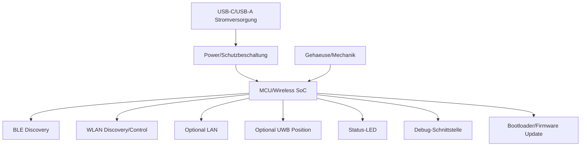

# RKWS-0270 Hardware Architecture V0

Dokument-ID: RKWS-SPEC-HW-ARCH-001  
Version: 1.0.0  
Status: Accepted  
Datum: 2026-07-02

## Zweck

Dieses Dokument beschreibt die Hardwarearchitektur V0. Es wird keine Platine entwickelt und keine endgueltige Hardwareauswahl getroffen.

## Blockdiagramm

## Komponenten

| Bereich | Anforderung |
| --- | --- |
| USB-C | Primaere Versorgung, spaeter ggf. Service-Port. |
| USB-A | Nur falls Adapter- oder Legacy-Szenario erforderlich. |
| Stromversorgung | Stabil, geschuetzt, ausreichend fuer Funkspitzen. |
| BLE | Discovery, Pairing-Signale, keine grossen Payloads. |
| WLAN | Discovery, Steuerkommunikation, ggf. Netzwerkzugang. |
| LAN | Optional fuer stabile Industrie- oder KVM-Szenarien. |
| UWB | Optional, nur Positionsbestimmung. |
| Firmware | Identity, Discovery, Pairing, Diagnose, Update. |
| Status-LED | Pairing, Fehler, Update, Betriebszustand. |
| Bootloader | Sicherer Update- und Recovery-Pfad. |
| Firmware-Update | Signiert, rollback-faehig, nachvollziehbar. |
| Debug-Schnittstelle | Entwicklung und Labor, spaeter gesichert/deaktivierbar. |
| Gehaeuse | Monitor-/Arbeitsplatzmontage beruecksichtigen. |
| Mechanik | Zugentlastung, thermische Luft, robuste Montage. |
| Testpunkte | Produktion und Laborzugriff. |
| Schutzbeschaltung | Ueberstrom, ESD, Verpolung soweit relevant. |
| ESD | Schutz an externen Schnittstellen. |
| Thermik | Dauerbetrieb ohne kritische Temperatur. |
| Produktion | Programmierung, Seriennummern, Identity-Provisioning. |

## Grenzen

V0 entwirft keine Platine. V0 definiert nur Architektur und Bewertungsrahmen fuer spaetere Beschaffung und Prototypen.

## Querverweise

- `Spec/HardwareSourcing.md`
- `Spec/Firmware.md`
- `Docs/ADR/ADR-0002-optional-hardware-dongles.md`
- `Docs/ADR/ADR-0008-uwb-for-positioning-only.md`

## Aenderungsverlauf

| Version | Datum | Aenderung |
| --- | --- | --- |
| 1.0.0 | 2026-07-02 | Hardwarearchitektur V0 fuer RKWS-0270 definiert. |
