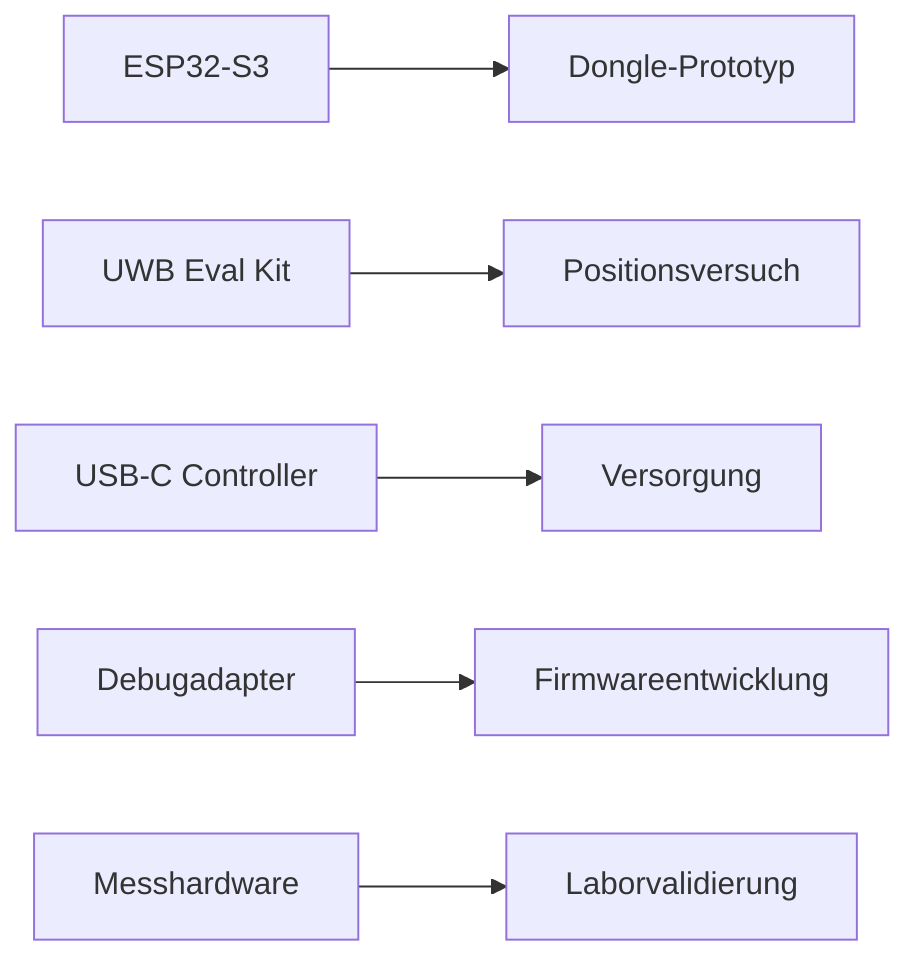

# RKWS-0280 Hardware Sourcing Evaluation

Dokument-ID: RKWS-SPEC-HW-SOURCING-001  
Version: 1.0.0  
Status: Accepted  
Datum: 2026-07-02

## Zweck

Dieses Dokument recherchiert und bewertet geeignete Hardwareplattformen auf Architektur-Ebene. Es trifft keine endgueltige Auswahl. Preise und Verfuegbarkeit sind Momentaufnahmen und muessen vor Beschaffung aktuell geprueft werden.

## Bewertungsmatrix

| Kategorie | Vorteile | Nachteile | Preis | Verfuegbarkeit | Entwicklungsaufwand |
| --- | --- | --- | --- | --- | --- |
| ESP32-S3 | WLAN/BLE integriert, gute Toolchain, guenstig. | Kein natives UWB, Security je Board unterschiedlich. | Niedrig. | Hoch. | Niedrig bis mittel. |
| UWB-Entwicklungskits | Praezise Positionsversuche moeglich. | Teurer, Integration komplexer. | Mittel bis hoch. | Mittel. | Mittel bis hoch. |
| USB-C Controller | Saubere Versorgung/PD-Optionen. | Zusaetzliche Komplexitaet. | Niedrig bis mittel. | Hoch. | Mittel. |
| Evaluation Boards | Schneller Start, Dokumentation. | Nicht produktionsnah. | Mittel. | Hoch bis mittel. | Niedrig. |
| Programmieradapter | Flash/Provisioning reproduzierbar. | Board-spezifisch. | Niedrig. | Hoch. | Niedrig. |
| Debugadapter | JTAG/SWD/Serial Diagnose. | Sicherheitsrisiko in Produktion. | Niedrig bis mittel. | Hoch. | Mittel. |
| Messhardware | Strom, Funk, Thermik messbar. | Kosten und Laboraufwand. | Mittel bis hoch. | Hoch. | Mittel. |

## Kandidatenbeziehung

## Beschaffungsprinzip

Zuerst werden Entwicklungsboards beschafft, nicht eigene Platinen. Die Auswahl muss Security, Firmware-Update, Debug, Versorgung, UWB-Erweiterbarkeit und Verfuegbarkeit bewerten.

## Querverweise

- `Spec/HardwareArchitectureV0.md`
- `hardware/Boards.md`
- `hardware/Requirements.md`

## Aenderungsverlauf

| Version | Datum | Aenderung |
| --- | --- | --- |
| 1.0.0 | 2026-07-02 | Hardwarebeschaffung fuer RKWS-0280 bewertet. |
