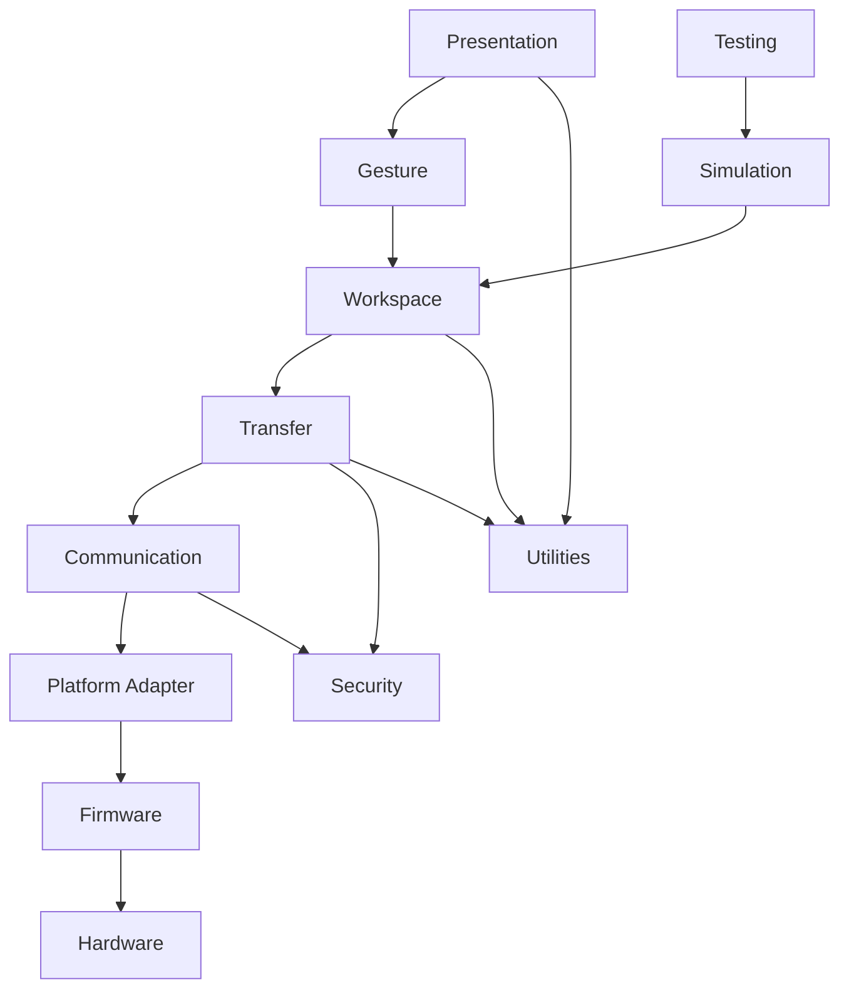

# RKWS-0400 Layer Model

Dokument-ID: RKWS-SPEC-LAYER-001  
Version: 1.0.0  
Status: Accepted  
Datum: 2026-07-02

## Zweck

Dieses Dokument definiert das verbindliche Schichtenmodell fuer RK Workspace. Es legt erlaubte Kommunikationsrichtungen und unzulaessige Zugriffe fest.

## Layer

## Verantwortungen

| Layer | Verantwortung |
| --- | --- |
| Presentation | Setup, Diagnose, Administration, Logs, Zielvisualisierung. |
| Gesture | Plattformereignisse in neutrale Intents uebersetzen. |
| Workspace | Arbeitsflaechen, Raumkarte, Capabilities, Trust-Bezug. |
| Transfer | Objektlebenszyklus, State Machine, Transferplanung. |
| Communication | Protokollnachrichten und Payload-Transportadapter. |
| Security | Pairing, Auth, Schluessel, Policy, Revocation. |
| Platform Adapter | OS-APIs, Berechtigungen, lokale Ressourcen. |
| Firmware | Dongle-Firmware-Verwaltung und Node-Status. |
| Hardware | Physische Nodes, Funk, Strom, Sensorik. |
| Utilities | Gemeinsame nichtfachliche Hilfen, Logging-Schnittstellen. |
| Testing | Test-Harness und Conformance. |
| Simulation | Simulierte Arbeitsflaechen und Szenarien. |

## Erlaubte Kommunikationsrichtungen

Hoehere Layer duerfen niedrigere Layer nur ueber definierte Interfaces ansprechen. Niedrigere Layer duerfen keine fachlichen Rueckgriffe auf hoehere Layer machen, sondern Ereignisse ueber Interfaces oder Event Streams melden. Security und Utilities sind querschnittlich, muessen aber trotzdem als Schnittstellen konsumiert werden.

## Unzulaessige Zugriffe

- Core oder Workspace Layer darf nicht direkt auf Operating-System-APIs zugreifen.
- Presentation darf keine Payload-Verschluesselung selbst implementieren.
- Gesture darf keine Transfers direkt ausfuehren.
- Communication darf keine Raumkarte veraendern.
- Hardware darf keine Workspace-Policies entscheiden.
- Firmware darf keine Benutzerinteraktion erzwingen.
- Testing darf keine produktiven Policies umgehen.

## Querverweise

- `Spec/PluginArchitecture.md`
- `Spec/PluginDependencyDiagram.md`
- `Spec/SecurityModel.md`
- `Spec/TestStrategy.md`

## Aenderungsverlauf

| Version | Datum | Aenderung |
| --- | --- | --- |
| 1.0.0 | 2026-07-02 | Schichtenmodell fuer RKWS-0400 definiert. |
