# RKWS-0210 Object Model Specification

Dokument-ID: RKWS-SPEC-OBJECT-001  
Version: 1.1.0
Status: Accepted  
Datum: 2026-07-02

## Zweck

Das Objektmodell definiert, welche digitalen Objekte RK Workspace zwischen Arbeitsflaechen bewegen kann und welche Metadaten fuer jeden Transfer verbindlich sind. Das Modell ist plattformneutral und gilt fuer Smart Devices, Display Nodes, Headless Nodes, KVM Nodes und spaetere Cloud- oder Hybrid-Workspaces.

## TransferObject

Ein `TransferObject` beschreibt ein Objekt, das zwischen Arbeitsflaechen bewegt werden soll. Es ist nicht zwingend die Payload selbst. Es kann auf Inline-Inhalt, lokale Pfade, temporaere Caches, Content-Adressen oder URLs verweisen.

| Feld | Pflicht | Beschreibung |
| --- | --- | --- |
| `ObjectId` | Ja | Global eindeutige Objektkennung fuer Logging, Retry und Audit. |
| `ObjectType` | Ja | Typ des Objekts. |
| `DisplayName` | Ja | Benutzerlesbarer Name. |
| `MimeType` | Ja | MIME-Type oder `application/octet-stream`, wenn unbekannt. |
| `SourceWorkspaceId` | Ja | Quell-Arbeitsflaeche. |
| `TargetWorkspaceId` | Ja | Ziel-Arbeitsflaeche. |
| `Size` | Ja | Groesse in Bytes, bei unbekannter Groesse `0` plus Statushinweis. |
| `PayloadReference` | Ja | Referenz auf Inhalt oder Speicherort. |
| `CreatedAt` | Ja | UTC-Zeitpunkt der Transferobjekterzeugung. |
| `Checksum` | Ja | Integritaetswert, bevorzugt SHA-256. |
| `EncryptionInfo` | Ja | Algorithmus, KeyId, Nonce und optionale Zusatzdaten. |
| `TransferStatus` | Ja | Aktueller Status gemaess State Machine. |

## Object Types

| Typ | Beschreibung | V0.1 Status |
| --- | --- | --- |
| `Text` | Reiner Text oder Textausschnitt. | Muss funktionieren. |
| `Image` | Bilddatei oder Bilddaten. | Modelliert, noch kein V0.1-Payload. |
| `File` | Einzelne Datei. | Modelliert, nach Texttransfer. |
| `Pdf` | PDF-Datei oder PDF-Payload. | Modelliert, nach Datei-Transfer. |
| `Folder` | Ordner mit Inhalt und Struktur. | Modelliert, spaeter. |
| `Link` | URL oder Deep Link. | Modelliert, spaeter. |
| `Clipboard` | Clipboard-Inhalt mit Ursprungskontext. | Modelliert, spaeter. |
| `Unknown` | Nicht erkannter Typ. | Darf nicht automatisch uebertragen werden. |
| `Context` | Spaeterer Arbeitskontext. | Zukunftserweiterung. |
| `Application` | Spaeterer Anwendungszustand. | Zukunftserweiterung. |

## PayloadReference

| Kind | Bedeutung | Risiko |
| --- | --- | --- |
| `InlineText` | Payload ist direkt im Modell enthalten. | Groessenlimit erforderlich. |
| `LocalPath` | Payload liegt lokal auf der Quelle. | Pfadrechte und TOCTOU-Risiko. |
| `ContentAddress` | Payload wird ueber Hash/Adresse referenziert. | Cache- und Verfuegbarkeitsrisiko. |
| `Url` | Payload oder Link ist eine URL. | Externe Verfuegbarkeit und Phishing. |
| `TemporaryCache` | Payload liegt in temporaerem Transfercache. | Ablaufzeit und Bereinigung. |
| `Unknown` | Unklare Referenz. | Darf nicht ohne Benutzerbestaetigung laufen. |

## TransferStatus

`TransferStatus` bildet die technische Sicht auf den Objekttransfer ab. Der Transferprozess selbst wird in `Spec/StateMachine.md` normativ beschrieben.

| Status | Bedeutung |
| --- | --- |
| `Created` | Objektmetadaten wurden erzeugt. |
| `ObjectSelected` | Benutzer hat ein Objekt markiert. |
| `GestureActive` | Greif- oder Richtungsgeste ist aktiv. |
| `TargetSearch` | Zielsuche laeuft. |
| `TargetLocked` | Ziel wurde festgelegt. |
| `TransferPending` | Transfer ist geplant, aber noch nicht laufend. |
| `TransferRunning` | Payload wird uebertragen. |
| `TransferVerified` | Checksum und Metadaten wurden validiert. |
| `Completed` | Transfer ist abgeschlossen. |
| `Cancelled` | Benutzer oder System hat abgebrochen. |
| `Failed` | Transfer ist fehlgeschlagen. |
| `Timeout` | Zeitlimit wurde erreicht. |
| `Rejected` | Ziel hat abgelehnt. |
| `Retry` | Wiederholversuch ist geplant. |
| `Rollback` | Rueckabwicklung laeuft. |
| `Archived` | Objektlog wurde archiviert. |

## Lebenszyklus

```mermaid
flowchart LR
    Create["Erzeugen"] --> Select["Markieren"]
    Select --> Grab["Greifen"]
    Grab --> TransferObject["Transferobjekt erzeugen"]
    TransferObject --> Encrypt["Verschluesseln"]
    Encrypt --> Target["Ziel bestimmen"]
    Target --> Send["Uebertragen"]
    Send --> Receive["Empfangen"]
    Receive --> Validate["Validieren"]
    Validate --> Render["Darstellen"]
    Render --> Open["Oeffnen"]
    Open --> Archive["Archivieren"]
```

## Fehlerfaelle pro Phase

| Phase | Fehlerfaelle | Reaktion |
| --- | --- | --- |
| Erzeugen | Objekt leer, Typ unbekannt, Berechtigung fehlt. | Ablehnen oder `Unknown` mit Bestaetigung. |
| Markieren | Mehrdeutige Auswahl, App erlaubt keinen Zugriff. | Benutzerfeedback, kein Transfer. |
| Greifen | Gestenkonflikt, Timeout, Barrierefreiheit. | Abbruch zu `Idle` oder Fallback-UI. |
| Transferobjekt erzeugen | Metadaten unvollstaendig, Size unbekannt. | Transfer blockieren oder Warnstatus. |
| Verschluesseln | Kein Session-Key, Algorithmus nicht unterstuetzt. | `Failed` oder neues Pairing. |
| Ziel bestimmen | Keine Arbeitsflaeche in Richtung, mehrere Ziele. | Zielauswahl oder `Target Search` fortsetzen. |
| Uebertragen | Netzwerkfehler, Unterbrechung, Quote ueberschritten. | Retry, Timeout oder Rollback. |
| Empfangen | Ziel hat keinen Speicher, Typ nicht erlaubt. | Reject oder Failed. |
| Validieren | Checksum falsch, MIME-Type unsicher. | Reject, Quarantaene oder Rollback. |
| Darstellen | Ziel-App fehlt, Preview nicht moeglich. | Ablage plus Hinweis. |
| Oeffnen | Benutzerrechte fehlen, Datei blockiert. | Nicht oeffnen, aber Transferstatus erhalten. |
| Archivieren | Log-Speicher voll, Retention-Konflikt. | Diagnosemeldung, lokaler Fallback. |

## MA003.04 Transfer Object Manager

MA003.04 fuehrt den plattformneutralen Transfer Object Manager als vierte produktive Core-Komponente ein. Die Implementierung liegt in `src/Core/TransferObjects/` und verwaltet Transferobjekte ausschliesslich im Speicher.

Der Manager stellt folgende Bausteine bereit:

- `TransferObjectId` als starke Objektkennung.
- `TransferObjectType` fuer Text, File, Folder, PDF, Image, Clipboard, Link, Context, Binary und Unknown.
- `TransferObjectState` fuer Created, Validated, Queued, Prepared, Locked, Completed, Cancelled, Failed und Archived.
- `TransferMetadata` mit ObjectId, DisplayName, MimeType, Size, Checksum, CreatedAt, ModifiedAt, SourceWorkspace, TargetWorkspace, Owner, Priority, Tags und Version.
- `TransferHistoryEntry` fuer Zeit, Aktion, Benutzer, Workspace und Beschreibung.
- `ITransferObject` und `ITransferObjectManager` als plattformneutrale Vertraege.
- `TransferObjectManager` fuer Create, Delete, Archive, Clone, Get, GetAll, UpdateMetadata, UpdateState, Find, Snapshot und Validate.
- `TransferObjectException` mit stabilen Fehlercodes.

Dieser Schritt implementiert keine Payload-Uebertragung, keine Persistenz, keine Netzwerkkommunikation, keine OS-Pfade als Betriebssystemoperation, keine GUI und keine Cloud. Integration mit Workspace Registry, Capability Manager und Plugin Manager wird ueber neutrale IDs, Metadaten und spaetere Core-Integrationstests vorbereitet.

## Querverweise

- `Spec/StateMachine.md`
- `Spec/WorkspaceModel.md`
- `Spec/SecurityModel.md`
- `Docs/ADR/ADR-0001-workspaces-instead-of-devices.md`

## Aenderungsverlauf

| Version | Datum | Aenderung |
| --- | --- | --- |
| 1.1.0 | 2026-07-02 | MA003.04 Transfer Object Manager als plattformneutrale Core-Komponente dokumentiert. |
| 1.0.0 | 2026-07-02 | Vollstaendiges Objektmodell fuer RKWS-0210 definiert. |
| 0.1.0 | 2026-07-02 | Erste Objektmodell-Skizze angelegt. |
