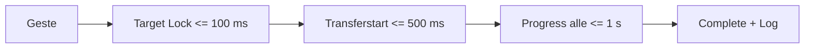

# RKWS-0420 Performance Targets

Dokument-ID: RKWS-SPEC-PERFORMANCE-001  
Version: 1.0.0  
Status: Accepted  
Datum: 2026-07-02

## Zweck

Dieses Dokument definiert messbare Zielwerte. Sie dienen spaeter als Referenz fuer Prototypen, Tests und Release-Entscheidungen. V0.1 muss nicht alle Langfristwerte erreichen, soll aber Abweichungen dokumentieren.

## Zielwerte

| Bereich | V0.1 Ziel | Langfristiges Ziel | Messmethode |
| --- | --- | --- | --- |
| Discovery | neue lokale Workspace-Anzeige <= 3 s | <= 1 s im stabilen LAN | Discovery-Test mit 2-5 Nodes. |
| Heartbeat | Intervall 5-15 s konfigurierbar | adaptiv nach Netzlast | Log-Auswertung. |
| Pairing | Benutzerflow <= 60 s | <= 30 s | Pairing-Szenario. |
| Transferstart | nach Target Lock <= 500 ms | <= 200 ms | Zeit zwischen Loslassen und Start. |
| Texttransfer | <= 1 s fuer kleine Texte | wahrnehmbar sofort | Simulation + Integration. |
| Latenz UI-Feedback | <= 100 ms | <= 50 ms | Gesture-to-feedback Messung. |
| Datei-Transferdauer | Netzwerkabhaengig, mindestens Fortschritt alle 1 s | nahe Netto-Netzwerkleistung | Chunk/Progress-Metriken. |
| CPU Desktop Idle | < 2 % Durchschnitt | < 1 % | OS-Metriken. |
| RAM Desktop Agent | < 200 MB | < 100 MB | Prozessmessung. |
| Firmware Boot | <= 3 s bis Discovery | <= 1.5 s | Hardwaretest. |
| Firmware Update | robust, rollback-faehig | <= 2 min typische Firmware | Firmwaretest. |
| Energie Dongle | USB versorgt, keine Ueberhitzung | < 1 W typisch, falls realistisch | Labormessung. |
| Mehrgeraetebetrieb | 5 Workspaces stabil | 20+ Workspaces | Simulation + Integration. |
| Logging Overhead | < 5 % Transferoverhead | < 2 % | Benchmark. |

## Performance-Budget

## Regeln

Jeder produktive Transferpfad muss Zeitstempel fuer Zielsuche, Target Lock, Transferstart, Progress, Verifikation und Abschluss loggen. Performance-Ziele duerfen nicht durch Entfernen von Security- oder Logging-Schritten erreicht werden.

## Querverweise

- `Spec/TestStrategy.md`
- `Spec/Protocol.md`
- `Spec/QualityGoals.md`

## Aenderungsverlauf

| Version | Datum | Aenderung |
| --- | --- | --- |
| 1.0.0 | 2026-07-02 | Performance-Ziele fuer RKWS-0420 definiert. |
