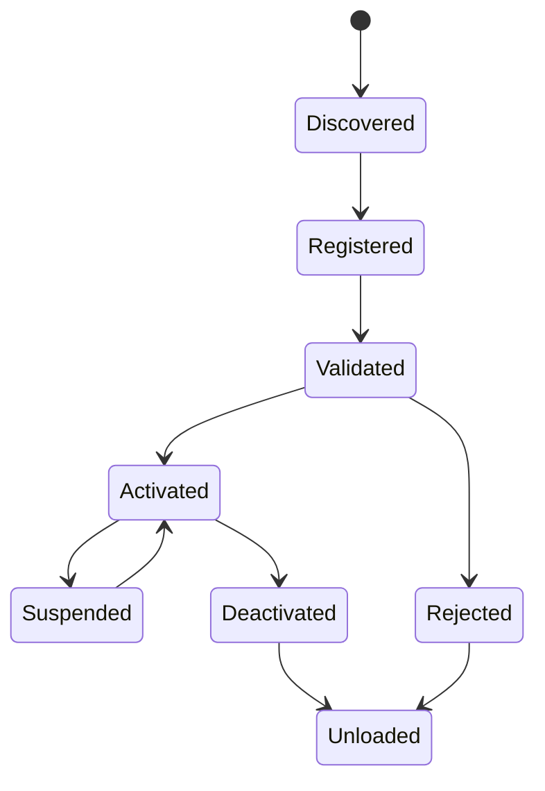

# RKWS-0360 Plugin Architecture

Dokument-ID: RKWS-SPEC-PLUGIN-001  
Version: 1.2.0
Status: Accepted  
Datum: 2026-07-02

## Zweck

RK Workspace wird auf ein Plugin-System erweitert. Der Core darf keine Plattformlogik enthalten. Alle Plattformfunktionen, Hardwarefunktionen, Kommunikationsfunktionen und erweiterten Integrationen werden ueber Plugins oder Adapter eingebunden.

## Grundmodell

```mermaid
flowchart TB
    Core["Platform-neutral Core"] --> Manager["Plugin Manager"]
    Manager --> Workspace["Workspace Plugin"]
    Manager --> Gesture["Gesture Plugin"]
    Manager --> Transfer["Transfer Plugin"]
    Manager --> Discovery["Discovery Plugin"]
    Manager --> Communication["Communication Plugin"]
    Manager --> Security["Security Plugin"]
    Manager --> Hardware["Hardware Plugin"]
    Manager --> Display["Display Plugin"]
    Manager --> Context["Context Plugin"]
    Manager --> Clipboard["Clipboard Plugin"]
    Manager --> Logging["Logging Plugin"]
    Manager --> Configuration["Configuration Plugin"]
    Manager --> Testing["Testing Plugin"]
    Manager --> Simulation["Simulation Plugin"]
    Manager --> Firmware["Firmware Plugin"]
    Manager --> Update["Update Plugin"]
```

Der Plugin Manager verwaltet Registrierung, Capability-Ankuendigung, Lebenszyklus, Versionierung, Aktivierung, Deaktivierung und Dependency-Validierung. Plugins duerfen den Core nicht ersetzen und duerfen keine zyklischen Abhaengigkeiten erzeugen.

## MA003.01 Implementierungsstatus

MA003.01 fuehrt den ersten produktiven, plattformneutralen Core-Baustein fuer diese Spezifikation ein. Implementiert werden die neutralen Plugin-Vertraege, `PluginDescriptor`, `PluginType`, `PluginState`, `PluginLoadResult`, `PluginException` und `PluginManager`.

Dieser Schritt implementiert noch kein dynamisches Laden aus Dateisystemen, keine Platform Adapter, keine Reflection-basierte Plugin-Erkennung, keine Kommunikation und keine Betriebssystemintegration. Der Plugin Manager verwaltet ausschliesslich bereits uebergebene `IPlugin`-Instanzen und deren Lifecycle.

## MA003.02 Capability-Integration

MA003.02 ergaenzt den plattformneutralen Capability Manager als eigenstaendigen Core-Baustein. Er ist semantisch mit dem Plugin-System verbunden, erzeugt aber keine harte zyklische Abhaengigkeit zwischen `RKWorkspace.Core.Plugins` und `RKWorkspace.Core.Capabilities`.

Die in `PluginDescriptor` vorhandenen Capability-Listen bleiben manifestnah und stringbasiert. Ihre Werte werden fachlich auf stabile `CapabilityId`-Namen abgebildet, ohne dass der Plugin Manager selbst eine Plattform- oder Provider-Entscheidung trifft. Konkrete Plugins oder Adapter koennen spaeter zugleich `IPlugin` und `ICapabilityProvider` erfuellen oder durch einen separaten Adapter als Capability Provider registriert werden.

Damit bleiben zwei Verantwortungen getrennt:

- Der Plugin Manager verwaltet Registrierung, Dependency-Pruefung und Lifecycle.
- Der Capability Manager verwaltet gemeldete Faehigkeiten, Requirements Matching und Provider-Auswahl.

## Plugin-Vertraege

| Plugin | Verantwortung | Schnittstellen | Eingaben | Ausgaben | Lebenszyklus | Abhaengigkeiten |
| --- | --- | --- | --- | --- | --- | --- |
| Workspace Plugin | Arbeitsflaechen registrieren, aktualisieren und klassifizieren. | Workspace Registry, Capability Query. | WorkspaceDescriptor, DeviceIdentity. | WorkspaceSnapshot, WorkspaceEvents. | Register, Validate, Activate, Heartbeat, Deactivate. | Configuration, Logging, Security. |
| Gesture Plugin | Plattformgesten in neutrale Intent Events uebersetzen. | Gesture Intent API. | OS/Device gesture events, selected object hints. | GestureActive, DirectionIntent, CancelIntent. | Register, Bind, Suspend, Resume, Unbind. | Workspace, Display, Logging. |
| Transfer Plugin | Transferplanung und Transferstatus koordinieren. | Transfer Planning API, State Machine API. | TransferObject, SourceWorkspace, TargetWorkspace. | TransferStatus, TransferEvents. | Register, Prepare, Run, Verify, Complete, Rollback. | Security, Communication, Logging. |
| Discovery Plugin | Arbeitsflaechen lokal finden. | Discovery Provider API. | Network/BLE announcements, scan requests. | DiscoveredWorkspace, Heartbeat. | Register, Scan, Announce, Heartbeat, Stop. | Configuration, Logging. |
| Communication Plugin | Nachrichten und Payload-Transport bereitstellen. | Protocol Transport API. | ProtocolMessage, encrypted payload chunks. | ProtocolEvents, TransferProgress. | Register, Negotiate, Connect, Send, Close. | Security, Logging. |
| Security Plugin | Pairing, Auth, Schluessel, Trust und Revocation. | Trust API, Key API, Pairing API. | Identity material, pairing challenge, policy. | TrustDecision, SessionKeys, RevocationEvents. | Register, Provision, Pair, Authenticate, Rotate, Revoke. | Configuration, Logging. |
| Hardware Plugin | Hardware Nodes und physische Capabilities melden. | Hardware Node API. | Board identity, sensors, USB/LAN/BLE status. | HardwareCapability, NodeHealth. | Register, Probe, Monitor, Diagnose, Shutdown. | Firmware, Logging, Security. |
| Display Plugin | Display- und Overlay-Faehigkeiten bereitstellen. | Display Surface API, Overlay API. | Workspace display info, target hints. | TargetHighlight, OverlayEvents. | Register, Detect, Render, Clear, Suspend. | Workspace, Gesture, Logging. |
| Context Plugin | Spaetere Kontext- und App-Zustandsuebertragung modellieren. | Context Capture API. | App/context descriptor, user intent. | ContextTransferObject. | Register, Capture, Serialize, Restore, Archive. | Security, Transfer, Logging. |
| Clipboard Plugin | Clipboard-Inhalte plattformneutral bereitstellen. | Clipboard Adapter API. | Clipboard read/write request. | ClipboardObject, ClipboardResult. | Register, PermissionCheck, Read, Write, Clear. | Security, Transfer, Logging. |
| Logging Plugin | Strukturierte Logs, Audit und Diagnose. | Logging API, Audit API. | Events, errors, metrics. | LocalLog, DiagnosticBundle. | Register, Configure, Write, Rotate, Export. | Configuration. |
| Configuration Plugin | Einstellungen, Policies und Raumkarte bereitstellen. | Config API, Policy API, Room Map API. | User settings, admin policy, workspace map. | ConfigSnapshot, PolicyDecision. | Register, Load, Validate, Watch, Persist. | Logging, Security. |
| Testing Plugin | Test-Harness, Fixtures und Conformance. | Test Provider API. | Test case, simulated events. | TestResult, CoverageData. | Register, Setup, Run, Teardown. | Simulation, Logging. |
| Simulation Plugin | Simulierte Arbeitsflaechen und Transfers. | Simulation API. | Scenario definition. | SimulationLog, SimulatedTransferResult. | Register, LoadScenario, Execute, Report. | Testing, Logging, Workspace. |
| Firmware Plugin | Firmware-nahe Verwaltung fuer Dongles. | Firmware Management API. | Firmware version, device status, update package metadata. | FirmwareStatus, FirmwareDiagnostic. | Register, Detect, Validate, Stage, Report. | Hardware, Update, Security, Logging. |
| Update Plugin | Software- und Firmware-Updateprozesse koordinieren. | Update API. | Update manifest, package metadata. | UpdatePlan, UpdateResult. | Register, Check, Download, Verify, Stage, Apply, Rollback. | Security, Configuration, Logging. |

## Lebenszyklus eines Plugins

## Architekturregeln

- Plugins registrieren Capabilities, nicht Geraetetypen.
- Plugins duerfen nur ueber definierte Schnittstellen kommunizieren.
- Plugins duerfen keine zyklischen Abhaengigkeiten haben.
- Der Core darf Plugin-Implementierungen nicht kennen.
- Plattformadapter sind unterhalb von Plugins angesiedelt.
- Security-, Logging- und Configuration-Vertraege muessen fuer produktive Plugins vorhanden sein.

## Querverweise

- `Spec/PluginDependencyDiagram.md`
- `Spec/LayerModel.md`
- `Spec/CapabilityModel.md`
- `Spec/ProductPhilosophy.md`

## Aenderungsverlauf

| Version | Datum | Aenderung |
| --- | --- | --- |
| 1.2.0 | 2026-07-02 | MA003.02 Capability Manager Integration ohne zyklische Core-Abhaengigkeit dokumentiert. |
| 1.1.0 | 2026-07-02 | MA003.01 Plugin Manager Implementierungsstatus ergaenzt. |
| 1.0.0 | 2026-07-02 | Plugin-Architektur fuer RKWS-0360 definiert. |
