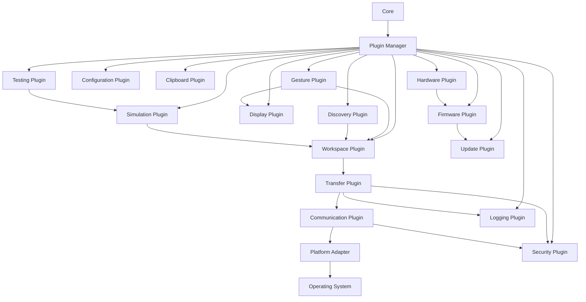
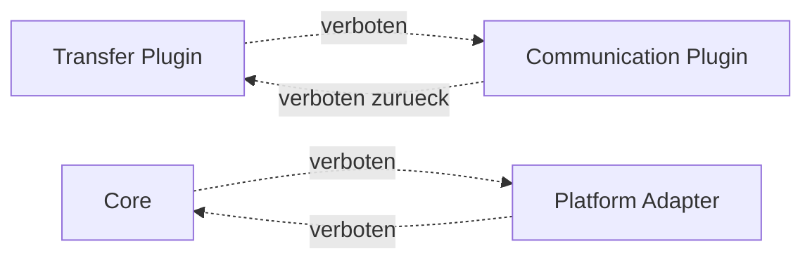

# RKWS-0390 Plugin Dependency Diagram

Dokument-ID: RKWS-SPEC-PLUGIN-DEPS-001  
Version: 1.0.0  
Status: Accepted  
Datum: 2026-07-02

## Zweck

Dieses Dokument definiert die erlaubten Plugin-Abhaengigkeiten. Zyklische Abhaengigkeiten sind unzulaessig.

## Gesamtdiagramm

## Erlaubte Abhaengigkeitsrichtung

| Von | Darf abhaengen von |
| --- | --- |
| Core | Plugin Manager Interfaces. |
| Plugin Manager | Plugin Manifests, Configuration, Logging. |
| Workspace Plugin | Configuration, Security, Logging. |
| Gesture Plugin | Workspace, Display, Logging. |
| Transfer Plugin | Workspace, Communication, Security, Logging. |
| Discovery Plugin | Workspace, Configuration, Logging. |
| Communication Plugin | Security, Logging, Platform Adapter. |
| Security Plugin | Configuration, Logging, optional Hardware. |
| Hardware Plugin | Firmware, Logging, Security. |
| Firmware Plugin | Hardware, Update, Security, Logging. |
| Testing Plugin | Simulation, Logging. |
| Simulation Plugin | Workspace, Transfer, Logging. |

## Unzulaessige Zyklen

Unzulaessig sind insbesondere Core-zu-OS-Abhaengigkeiten, Communication-zu-Transfer-Rueckverweise, Security-zu-UI-Abhaengigkeiten und Hardware-zu-Core-Direktzugriffe.

## Querverweise

- `Spec/PluginArchitecture.md`
- `Spec/LayerModel.md`
- `Docs/Architecture/ArchitectureBaseline.md`

## Aenderungsverlauf

| Version | Datum | Aenderung |
| --- | --- | --- |
| 1.0.0 | 2026-07-02 | Plugin-Abhaengigkeitsdiagramm fuer RKWS-0390 definiert. |
