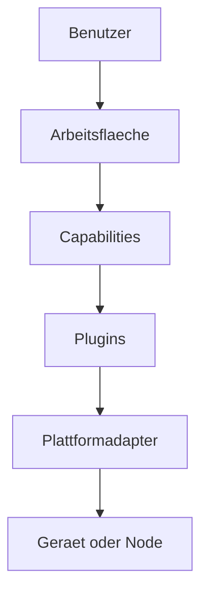

# RKWS-0350 Product Philosophy

Dokument-ID: RKWS-SPEC-PHILOSOPHY-001  
Version: 1.6.0
Status: Accepted  
Datum: 2026-07-02

## Zweck

Dieses Dokument definiert die Produktphilosophie von RK Workspace. Sie ist verbindlich fuer Architektur, UX, Plugins, Capabilities und spaetere Plattformimplementierungen.

Die Produktphilosophie folgt zuerst HX-000 in `Spec/HumanExperienceSpecification_HX000.md` und danach dem Nordstern in `Docs/Nordstern.md`. Wenn eine technische Entscheidung einer Human Experience widerspricht, wird die technische Entscheidung ueberarbeitet.

## Human-Experience-Prinzip

RK Workspace beginnt in der Wahrnehmung des Menschen.

Der Benutzer muss zuerst einen Arbeitsraum erleben, nicht mehrere Geraete, Fenster oder Betriebssysteme.

Vor jeder neuen Implementierung ist zu pruefen:

```text
Welche HX wird durch diese Funktion unterstuetzt?
```

Wenn keine HX unterstuetzt wird, wird nicht implementiert.

## Nordstern-Prinzip

Code folgt dem Gefuehl. Nicht umgekehrt.

Jede neue Funktion muss zuerst beantworten, was der Mensch in diesem Moment fuehlen soll. Der Massstab ist nicht nur, ob Code laeuft oder Tests gruen sind, sondern ob der Benutzer vergisst, dass er zwischen mehreren Geraeten arbeitet.

Human Experience Specifications beschreiben bewusste Wahrnehmungen vor einer Interaktion. HX-001 legt fest, dass ein Objekt zuerst als Teil der aktuellen Arbeit erscheinen muss, bevor es natuerlich gegriffen werden kann. HX-001A legt danach fest, dass das Objekt auf die Handlung des Menschen antworten muss, damit Kontrolle, Besitz und spaeteres Tragen entstehen.

Emotion Specifications konkretisieren diese Frage fuer einzelne Gefuehle. Sie fuehren zu Experimenten, nicht automatisch zu finaler Implementierung.

## Grundsaetze

Der Benutzer arbeitet niemals mit Geraeten als Primaerbegriff. Der Benutzer arbeitet ausschliesslich mit Arbeitsflaechen. Ein Geraet kann eine Arbeitsflaeche bereitstellen, mehrere Arbeitsflaechen enthalten oder nur eine technische Identitaet fuer eine Arbeitsflaeche liefern. Die Bedienung darf den Benutzer nicht zwingen, in Hostnamen, Betriebssystemen oder Transportkanaelen zu denken.

Objekte gehoeren keinem Geraet. Objekte gehoeren dem Benutzer und seinem Arbeitskontext. Wenn ein Objekt auf einer Arbeitsflaeche liegt, ist das eine aktuelle Position, keine Eigentumsbeziehung. Transfer bedeutet deshalb nicht, dass ein Geraet einem anderen Geraet etwas "sendet", sondern dass der Benutzer ein Objekt in seinem Arbeitsraum verlagert.

Arbeitsflaechen sind austauschbar. Hardware ist austauschbar. Software ist austauschbar. Die Benutzererfahrung bleibt identisch, solange die notwendigen Capabilities vorhanden sind. Ein Windows-Laptop, ein MacBook, ein Display Node oder ein spaeteres Smart Display koennen unterschiedliche technische Eigenschaften haben, duerfen aber dieselbe raeumliche Bedienidee anbieten.

Plattformen sind Implementierungsdetails. Windows, macOS, Linux, iOS, Android, Firmware und Cloud-Komponenten sind technische Adapter unterhalb der Produktsemantik. Sie beeinflussen Capabilities, Berechtigungen und Einschraenkungen, aber nicht die grundlegende Bedienphilosophie.

## Original-Owned-Prinzip

Ab MA007.00 gilt fuer kritische digitale Dinge zuerst:

```text
Das Original bleibt beim Owner.
Die andere Ablage erlebt das Ding als Frame.
```

Das ist keine Einschraenkung der Human Experience, sondern deren Schutz. Der Mensch soll ein Ding nehmen und an einer anderen Ablage weiterverwenden koennen, ohne dass RK Workspace still eine Datei kopiert oder eine neue Quelle der Wahrheit erzeugt.

Wenn spaeter CopyOut, ForkVersion oder MoveOwnership noetig werden, sind sie eigene bestaetigte Entscheidungen. Sie passieren nicht automatisch durch Ablegen.

## Architekturfolgen



## Verbindliche Regeln

- Keine UX darf den Geraetetyp als primaere Zielwahl verlangen.
- Keine Architekturentscheidung darf Capabilities durch feste Plattformannahmen ersetzen.
- Jede neue Plattformintegration muss als Plugin oder Adapter unterhalb des Core modelliert werden.
- Hardware darf die Bedienidee erweitern, aber nicht zur Pflicht fuer Smart Devices werden.
- Cloud darf optionaler Modus sein, aber nicht Grundvoraussetzung fuer lokale Arbeitsflaechen.

## Querverweise

- `Spec/HumanExperienceSpecification_HX000.md`
- `Docs/Nordstern.md`
- `Spec/HumanExperienceSpecification_HX001.md`
- `Spec/HumanExperienceSpecification_HX001A.md`
- `Spec/EmotionSpecification_ES001.md`
- `Spec/EmotionSpecification_ES002.md`
- `Docs/00_ProductVision.md`
- `Docs/ADR/ADR-0001-workspaces-instead-of-devices.md`
- `Spec/CapabilityModel.md`
- `Spec/PluginArchitecture.md`

## Aenderungsverlauf

| Version | Datum | Aenderung |
| --- | --- | --- |
| 1.7.0 | 2026-07-05 | Original-Owned-Prinzip fuer RKWP FrameOnly ergaenzt. |
| 1.6.0 | 2026-07-03 | HX-001A als Kontroll- und Antwortwahrnehmung ergaenzt. |
| 1.5.0 | 2026-07-03 | HX-000 als oberste Human-Experience-Regel vor Nordstern und Implementierung verankert. |
| 1.4.0 | 2026-07-03 | Human Experience Specification HX-001 als Wahrnehmung vor UX-Gefuehlen ergaenzt. |
| 1.3.0 | 2026-07-03 | Emotion Specification ES-002 als zweites Zielgefuehl verlinkt. |
| 1.2.0 | 2026-07-03 | Emotion Specifications als Bindeglied zwischen Nordstern und UX-Experimenten ergaenzt. |
| 1.1.0 | 2026-07-03 | Nordstern-Prinzip als verbindliche Produktphilosophie ergaenzt. |
| 1.0.0 | 2026-07-02 | Produktphilosophie fuer RKWS-0350 definiert. |
