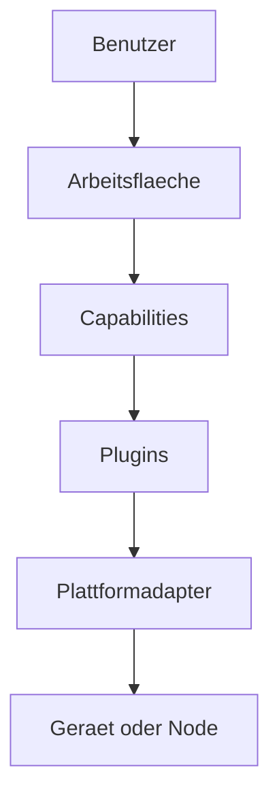

# RKWS-0350 Product Philosophy

Dokument-ID: RKWS-SPEC-PHILOSOPHY-001  
Version: 1.1.0
Status: Accepted  
Datum: 2026-07-02

## Zweck

Dieses Dokument definiert die Produktphilosophie von RK Workspace. Sie ist verbindlich fuer Architektur, UX, Plugins, Capabilities und spaetere Plattformimplementierungen.

Die Produktphilosophie folgt dem Nordstern in `Docs/Nordstern.md`. Wenn eine technische Entscheidung diesem Nordstern widerspricht, wird die technische Entscheidung ueberarbeitet.

## Nordstern-Prinzip

Code folgt dem Gefuehl. Nicht umgekehrt.

Jede neue Funktion muss zuerst beantworten, was der Mensch in diesem Moment fuehlen soll. Der Massstab ist nicht nur, ob Code laeuft oder Tests gruen sind, sondern ob der Benutzer vergisst, dass er zwischen mehreren Geraeten arbeitet.

## Grundsaetze

Der Benutzer arbeitet niemals mit Geraeten als Primaerbegriff. Der Benutzer arbeitet ausschliesslich mit Arbeitsflaechen. Ein Geraet kann eine Arbeitsflaeche bereitstellen, mehrere Arbeitsflaechen enthalten oder nur eine technische Identitaet fuer eine Arbeitsflaeche liefern. Die Bedienung darf den Benutzer nicht zwingen, in Hostnamen, Betriebssystemen oder Transportkanaelen zu denken.

Objekte gehoeren keinem Geraet. Objekte gehoeren dem Benutzer und seinem Arbeitskontext. Wenn ein Objekt auf einer Arbeitsflaeche liegt, ist das eine aktuelle Position, keine Eigentumsbeziehung. Transfer bedeutet deshalb nicht, dass ein Geraet einem anderen Geraet etwas "sendet", sondern dass der Benutzer ein Objekt in seinem Arbeitsraum verlagert.

Arbeitsflaechen sind austauschbar. Hardware ist austauschbar. Software ist austauschbar. Die Benutzererfahrung bleibt identisch, solange die notwendigen Capabilities vorhanden sind. Ein Windows-Laptop, ein MacBook, ein Display Node oder ein spaeteres Smart Display koennen unterschiedliche technische Eigenschaften haben, duerfen aber dieselbe raeumliche Bedienidee anbieten.

Plattformen sind Implementierungsdetails. Windows, macOS, Linux, iOS, Android, Firmware und Cloud-Komponenten sind technische Adapter unterhalb der Produktsemantik. Sie beeinflussen Capabilities, Berechtigungen und Einschraenkungen, aber nicht die grundlegende Bedienphilosophie.

## Architekturfolgen

## Verbindliche Regeln

- Keine UX darf den Geraetetyp als primaere Zielwahl verlangen.
- Keine Architekturentscheidung darf Capabilities durch feste Plattformannahmen ersetzen.
- Jede neue Plattformintegration muss als Plugin oder Adapter unterhalb des Core modelliert werden.
- Hardware darf die Bedienidee erweitern, aber nicht zur Pflicht fuer Smart Devices werden.
- Cloud darf optionaler Modus sein, aber nicht Grundvoraussetzung fuer lokale Arbeitsflaechen.

## Querverweise

- `Docs/Nordstern.md`
- `Docs/00_ProductVision.md`
- `Docs/ADR/ADR-0001-workspaces-instead-of-devices.md`
- `Spec/CapabilityModel.md`
- `Spec/PluginArchitecture.md`

## Aenderungsverlauf

| Version | Datum | Aenderung |
| --- | --- | --- |
| 1.1.0 | 2026-07-03 | Nordstern-Prinzip als verbindliche Produktphilosophie ergaenzt. |
| 1.0.0 | 2026-07-02 | Produktphilosophie fuer RKWS-0350 definiert. |
