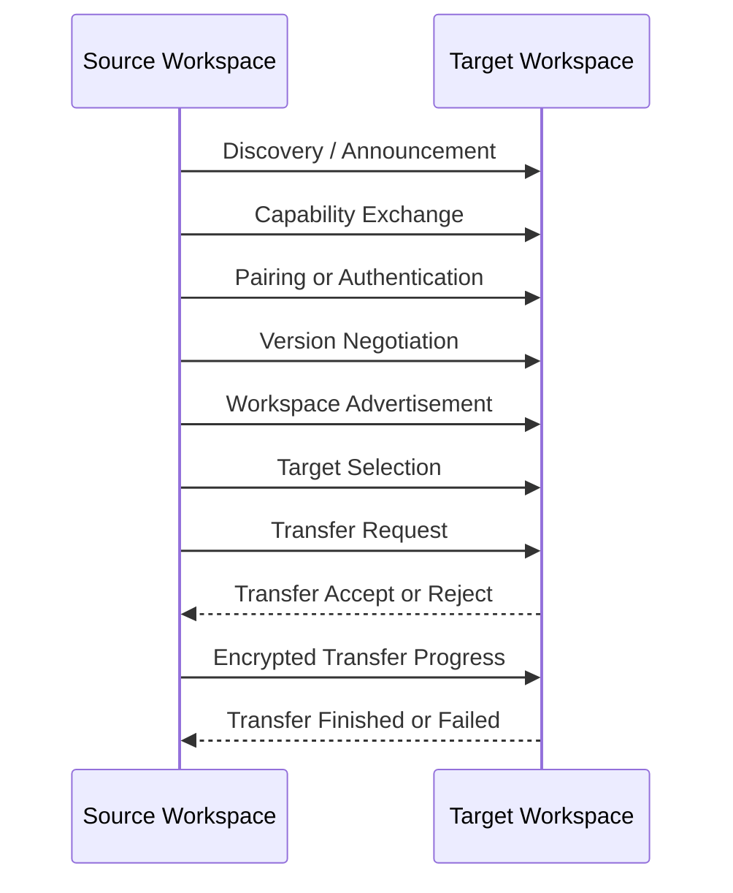

# RKWS-0240 Communication Protocol Specification

Dokument-ID: RKWS-SPEC-PROTOCOL-001  
Version: 1.0.0  
Status: Accepted  
Datum: 2026-07-02

## Zweck

Dieses Dokument spezifiziert das Kommunikationsprotokoll fuer RK Workspace. Es beschreibt Nachrichten, Phasen, Fehlercodes, Retry, Versionierung und Rueckwaertskompatibilitaet. Es ist noch keine Implementierung.

## Phasen

## Nachrichten

| Nachricht | Richtung | Zweck |
| --- | --- | --- |
| `DISCOVERY_PROBE` | Any -> Any | Aktive Suche nach Arbeitsflaechen. |
| `ANNOUNCEMENT` | Any -> Any | Praesenzmeldung im lokalen Umfeld. |
| `HEARTBEAT` | Any -> Any | Lebendigkeit und LastSeen aktualisieren. |
| `CAPABILITY_EXCHANGE` | Bidirektional | Objektarten, Protokollversionen, Limits austauschen. |
| `PAIRING_REQUEST` | Source -> Target | Pairing starten. |
| `PAIRING_CHALLENGE` | Target -> Source | Code/Fingerprint/Challenge liefern. |
| `PAIRING_CONFIRM` | Bidirektional | Benutzerbestaetigung signalisieren. |
| `AUTHENTICATION_START` | Bidirektional | Bestehende Identitaet authentifizieren. |
| `ENCRYPTION_NEGOTIATE` | Bidirektional | Cipher Suite und Session-Key aushandeln. |
| `WORKSPACE_ADVERTISEMENT` | Any -> Any | WorkspaceId, DisplayName, Position, Capabilities melden. |
| `TARGET_SELECTION` | Source -> Target | Ziel fuer Richtungstransfer anfragen oder locken. |
| `TRANSFER_REQUEST` | Source -> Target | TransferObject-Metadaten anbieten. |
| `TRANSFER_ACCEPT` | Target -> Source | Ziel akzeptiert Transfer. |
| `TRANSFER_REJECT` | Target -> Source | Ziel lehnt mit ErrorCode ab. |
| `TRANSFER_PROGRESS` | Bidirektional | Fortschritt, Chunk-Status, Retry-Hinweise. |
| `TRANSFER_FINISHED` | Target -> Source | Transfer empfangen und validiert. |
| `TRANSFER_FAILED` | Any -> Any | Fehler mit ErrorCode. |
| `VERSION_NEGOTIATION` | Bidirektional | Protokollversion bestimmen. |

## Version Negotiation

Jede Session beginnt mit unterstuetzten Major/Minor-Versionen. Major-Versionen duerfen brechen. Minor-Versionen muessen rueckwaertskompatibel sein. Eine Arbeitsflaeche muss die niedrigste gemeinsam unterstuetzte kompatible Version waehlen oder mit `ERR_VERSION_UNSUPPORTED` abbrechen.

## Error Codes

| Code | Bedeutung | Retry |
| --- | --- | --- |
| `ERR_UNKNOWN` | Unklassifizierter Fehler. | Nein. |
| `ERR_VERSION_UNSUPPORTED` | Keine kompatible Version. | Nein. |
| `ERR_NOT_PAIRED` | Keine gueltige Trust-Beziehung. | Nach Pairing. |
| `ERR_AUTH_FAILED` | Authentifizierung fehlgeschlagen. | Begrenzt. |
| `ERR_ENCRYPTION_REQUIRED` | Ziel verlangt Verschluesselung. | Nach Negotiation. |
| `ERR_CAPABILITY_UNSUPPORTED` | Objekttyp nicht unterstuetzt. | Nein. |
| `ERR_TARGET_NOT_FOUND` | Richtung hat kein Ziel. | Ja, nach Raumkartenupdate. |
| `ERR_TARGET_AMBIGUOUS` | Mehrere Ziele moeglich. | Nach Auswahl. |
| `ERR_PAYLOAD_TOO_LARGE` | Payload ueberschreitet Limit. | Nein. |
| `ERR_CHECKSUM_MISMATCH` | Integritaet fehlgeschlagen. | Einmaliger Retry moeglich. |
| `ERR_TIMEOUT` | Zeitlimit erreicht. | Ja, budgetiert. |
| `ERR_REJECTED_BY_POLICY` | Zielpolicy lehnt ab. | Nein. |
| `ERR_STORAGE_UNAVAILABLE` | Ziel kann nicht speichern. | Ja, falls temporaer. |
| `ERR_CANCELLED_BY_USER` | Benutzerabbruch. | Nein. |

## Retry Strategy

Retries sind begrenzt, zustandsbehaftet und muessen idempotent sein. Jeder Retry nutzt dieselbe `ObjectId`, eine neue Attempt-ID und muss Zielartefakte validieren, bevor Chunks fortgesetzt werden. Endlosschleifen sind verboten.

## Backward Compatibility

Neue Felder muessen optional oder mit Defaultwerten eingefuehrt werden, solange die Major-Version gleich bleibt. Entfernte oder semantisch geaenderte Felder erfordern eine neue Major-Version. Unknown-Nachrichten muessen mit einem strukturierten Fehler beantwortet werden.

## Querverweise

- `Spec/Communication.md`
- `Spec/SecurityModel.md`
- `Spec/StateMachine.md`
- `Docs/ADR/ADR-0004-separate-discovery-and-data-transfer.md`

## Aenderungsverlauf

| Version | Datum | Aenderung |
| --- | --- | --- |
| 1.0.0 | 2026-07-02 | Kommunikationsprotokoll fuer RKWS-0240 spezifiziert. |
