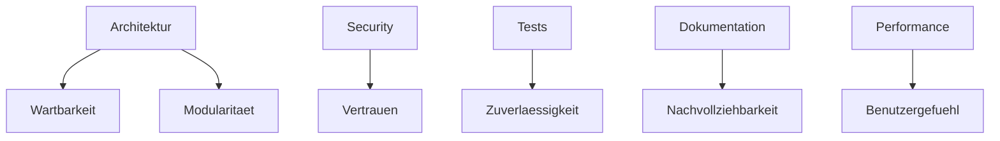

# RKWS-0430 Quality Goals

Dokument-ID: RKWS-SPEC-QUALITY-001  
Version: 1.0.0  
Status: Accepted  
Datum: 2026-07-02

## Zweck

Dieses Dokument definiert verbindliche Qualitaetsziele fuer RK Workspace. Sie gelten fuer Dokumentation, Core, Plugins, Plattformadapter, Firmware, Hardware und Tests.

## Qualitaetsziele

| Ziel | Definition | Nachweis |
| --- | --- | --- |
| Wartbarkeit | Aenderungen bleiben lokal und nachvollziehbar. | ADRs, Layer-Regeln, kleine Module. |
| Lesbarkeit | Code und Dokumentation sind klar, nummeriert und verlinkt. | Review, Dokumentstandard. |
| Testbarkeit | Kernregeln sind automatisiert pruefbar. | Unit, Simulation, Integration. |
| Erweiterbarkeit | Neue Plattformen und Nodes kommen ueber Plugins/Capabilities. | Plugin- und Capability-Spec. |
| Modularitaet | Keine zyklischen Abhaengigkeiten, klare Schnittstellen. | Dependency-Review. |
| Sicherheit | Trust, Pairing, Verschluesselung und Revocation sind Pflicht. | Security-Spec, Security-Tests. |
| Performance | Zielwerte werden gemessen und dokumentiert. | Performance-Metriken. |
| Plattformneutralitaet | Core bleibt frei von OS-Logik. | Code Review, Layer-Check. |
| Dokumentationsqualitaet | Normative Dokumente sind versioniert, verlinkt und diagrammiert. | Dokumentqualitaetscheck. |
| Codequalitaet | Warnungsfreier Build und klare Modelle. | CI, Lint/Format spaeter. |
| Hardwarequalitaet | Schutz, Update, Debug und Produktion sind geplant. | Hardware V0, Labortests spaeter. |

## Qualitaetsmodell

## Akzeptanzregel

Eine neue Funktion ist erst akzeptierbar, wenn sie fachlich spezifiziert, durch ADR oder bestehende Architektur abgedeckt, testbar, dokumentiert und mit den Qualitaetszielen vereinbar ist.

## Querverweise

- `Spec/DocumentationQuality.md`
- `Spec/TestStrategy.md`
- `Spec/PerformanceTargets.md`
- `Spec/LayerModel.md`

## Aenderungsverlauf

| Version | Datum | Aenderung |
| --- | --- | --- |
| 1.0.0 | 2026-07-02 | Qualitaetsziele fuer RKWS-0430 definiert. |
