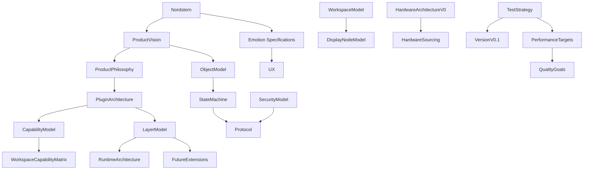

# RKWS Specification Index

Dokument-ID: RKWS-SPEC-INDEX  
Version: 0.7.0
Status: Accepted  
Datum: 2026-07-02

## Zweck

Dieses Verzeichnis enthaelt normative Spezifikationen. Dokumente in `Docs/` erklaeren Kontext und Architektur; Dokumente in `Spec/` definieren erwartetes Verhalten und Abnahmekriterien.

## Diagramm

## Startpunkte

- `../Docs/Nordstern.md`
- `EmotionSpecification_ES001.md`
- `ProductVision.md`
- `ProductPhilosophy.md`
- `PluginArchitecture.md`
- `PluginDependencyDiagram.md`
- `LayerModel.md`
- `RuntimeArchitecture.md`
- `CapabilityModel.md`
- `WorkspaceCapabilityMatrix.md`
- `ObjectModel.md`
- `WorkspaceModel.md`
- `DisplayNodeModel.md`
- `StateMachine.md`
- `Communication.md`
- `Protocol.md`
- `SecurityModel.md`
- `GestureModel.md`
- `HardwareArchitectureV0.md`
- `HardwareSourcing.md`
- `Firmware.md`
- `UX.md`
- `TestSpecification.md`
- `TestStrategy.md`
- `FutureExtensions.md`
- `PerformanceTargets.md`
- `QualityGoals.md`
- `VersionV0.1.md`
- `DocumentationQuality.md`

## Querverweise

- `Docs/Nordstern.md`
- `Docs/Architecture/ArchitectureFreeze.md`
- `Docs/Architecture/ArchitectureBaseline.md`
- `Docs/Architecture/ArchitectureBaselineReview.md`
- `Docs/Architecture/ArchitectureBaseline_v1.0.md`
- `Docs/Architecture/EngineeringReadinessCheck.md`
- `Docs/Glossary.md`
- `Docs/Architecture/ArchitectureReview.md`
- `Docs/ADR/README.md`

## Aenderungsverlauf

| Version | Datum | Aenderung |
| --- | --- | --- |
| 0.7.0 | 2026-07-03 | Emotion Specification ES-001 aufgenommen. |
| 0.6.0 | 2026-07-03 | Nordstern als obersten Orientierungspunkt aufgenommen. |
| 0.5.0 | 2026-07-02 | RuntimeArchitecture fuer Core Runtime Orchestrator aufgenommen. |
| 0.4.0 | 2026-07-02 | Readiness- und Glossarverweise fuer MA002B ergaenzt. |
| 0.3.0 | 2026-07-02 | Architecture Baseline Completion 002A in den Spezifikationsindex aufgenommen. |
| 0.2.0 | 2026-07-02 | Spezifikationsindex fuer Master-Arbeitsauftrag 002 erweitert. |
| 0.1.0 | 2026-07-02 | Spezifikationsindex angelegt. |
