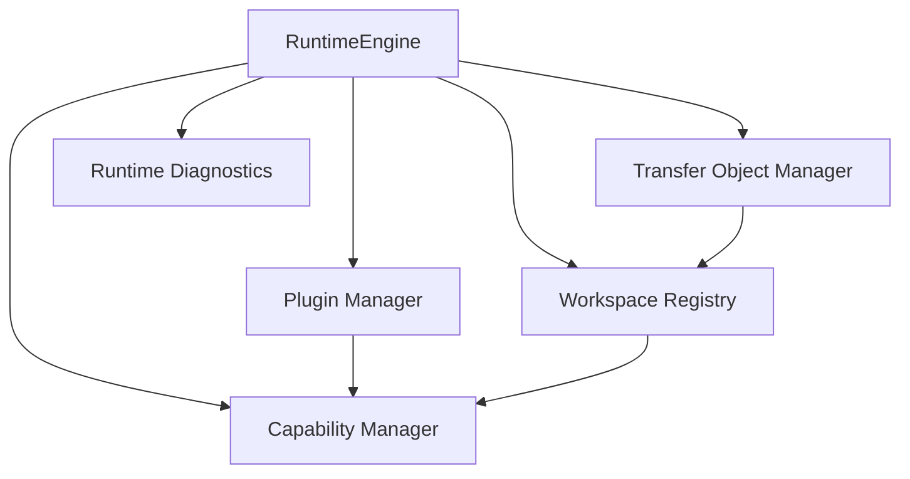
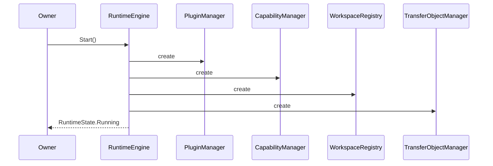
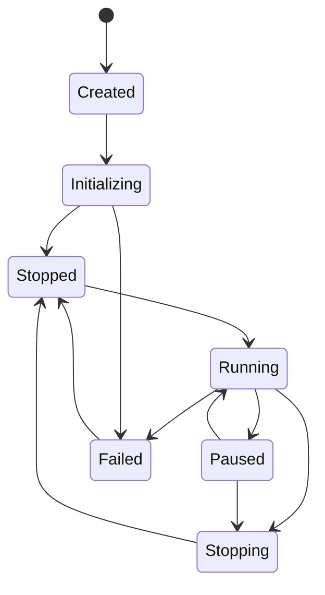

# RKWS-1620 Runtime Architecture

Dokument-ID: RKWS-SPEC-RUNTIME-001
Version: 1.0.0
Status: Accepted
Datum: 2026-07-02

## Zweck

Dieses Dokument definiert den plattformneutralen Core Runtime Orchestrator. Die Runtime ist die zentrale Lebenszyklussteuerung des RK Workspace Core und erzeugt die produktiven In-Memory-Core-Komponenten in einer festen Reihenfolge.

## Runtime-Komponenten

Die Runtime kennt keine Plattformadapter, kein Netzwerk, keine GUI, keine Persistenz, keine Cloud, keine Firmware und keine Hardware. Sie stellt nur den neutralen Core-Lebenszyklus bereit.

## Initialisierungsreihenfolge

## RuntimeState

Die Runtime verwendet folgende Zustaende:

- `Created`
- `Initializing`
- `Running`
- `Paused`
- `Stopping`
- `Stopped`
- `Failed`

Ungueltige Uebergaenge erzeugen eine `RuntimeException` und werden in `RuntimeDiagnostics.Errors` sichtbar.

## RuntimeConfiguration

`RuntimeConfiguration` verwaltet nur neutrale Flags:

- `LoggingEnabled`
- `SimulationEnabled`
- `TestModeEnabled`
- `DiagnosticsEnabled`
- `DebugModeEnabled`

Die Konfiguration enthaelt keine Betriebssystem-, Netzwerk-, GUI-, Firmware- oder Hardwareparameter.

## RuntimeDiagnostics

`RuntimeDiagnostics` enthaelt:

- Runtime-Version
- Startzeit
- Uptime
- Anzahl Plugins
- Anzahl Workspaces
- Anzahl TransferObjects
- RuntimeState
- Fehler
- Warnungen

## Lifecycle

`Stop()` und `Shutdown()` deaktivieren und entladen aktivierte Plugins ueber den Plugin Manager. Capability Manager, Workspace Registry und Transfer Object Manager sind plattformneutrale In-Memory-Komponenten und benoetigen keine Plattformbereinigung.

## Querverweise

- `Spec/LayerModel.md`
- `Spec/PluginArchitecture.md`
- `Spec/CapabilityModel.md`
- `Spec/WorkspaceModel.md`
- `Spec/ObjectModel.md`
- `Spec/TestStrategy.md`

## Aenderungsverlauf

| Version | Datum | Aenderung |
| --- | --- | --- |
| 1.0.0 | 2026-07-02 | Runtime Architecture fuer RKWS-1620 bis RKWS-1740 definiert. |
