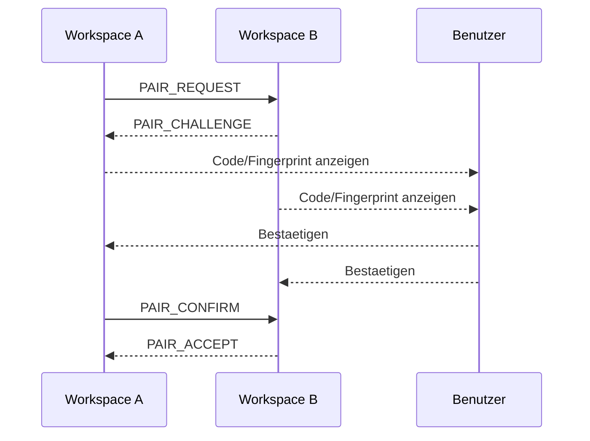

# RKWS-0230 Security Model Specification

Dokument-ID: RKWS-SPEC-SECURITY-001  
Version: 1.0.0  
Status: Accepted  
Datum: 2026-07-02

## Zweck

Das Sicherheitsmodell definiert Pairing, Schluesselverwaltung, Zertifikate, Vertrauensmodell, Geraetewechsel, Donglewechsel, Widerruf, Offlinebetrieb, Mehrgeraetebetrieb, Angriffsszenarien und Recovery.

## Sicherheitsstufen

| Stufe | Name | Beschreibung | Erlaubte Transfers |
| --- | --- | --- | --- |
| S0 | Unknown | Arbeitsflaeche ist unbekannt. | Keine. |
| S1 | Discovered | Arbeitsflaeche wurde gefunden, aber nicht gekoppelt. | Keine. |
| S2 | Pairing Pending | Pairing laeuft. | Keine Payloads. |
| S3 | Paired | Identitaet wurde bestaetigt. | Kleine Transfers nach Policy. |
| S4 | Trusted | Dauerhaft vertraut. | Transfers gemaess Capabilities. |
| S5 | Revoked | Vertrauen wurde widerrufen. | Keine. |
| S6 | Quarantined | Auffaellig oder kompromittiert. | Keine, Diagnose erlaubt. |

## Pairing

Pairing verbindet zwei Arbeitsflaechen oder eine Arbeitsflaeche und einen Dongle. Das Pairing muss eine Benutzerbestaetigung enthalten, einen Fingerprint oder Code anzeigen, die Identitaet speichern und einen Widerruf ermoeglichen.

## Schluesselverwaltung

Jede Device- oder Dongle-Identitaet besitzt ein langfristiges Identitaetsmaterial und nutzt kurzlebige Session-Schluessel fuer Transfers. Private Schluessel duerfen den lokalen sicheren Speicher nicht verlassen. Bei Dongles ist ein Secure Element zu pruefen. Session-Schluessel werden nach Transferende verworfen.

## Zertifikate

V0.1 darf self-signed oder lokal erzeugte Zertifikate nutzen, sofern Fingerprints beim Pairing geprueft werden. Spaetere Versionen koennen lokale CA, Hardware-rooted Identity oder Unternehmenszertifikate unterstuetzen.

## Vertrauensmodell

Vertrauen ist workspace-bezogen und device-gestuetzt. Ein Device kann mehrere Arbeitsflaechen haben. Wird ein Device ersetzt, muss jede betroffene Arbeitsflaeche neu bewertet werden. Trust darf nicht automatisch von einem alten Device auf ein neues Device uebergehen.

## Geraetewechsel und Donglewechsel

Bei Geraetewechsel wird die alte Identitaet widerrufen oder archiviert und die neue Identitaet neu gepairt. Bei Donglewechsel bleibt die Arbeitsflaeche semantisch erhalten, aber das Trust-Material muss erneuert werden. Benutzer muessen den Wechsel bewusst bestaetigen.

## Widerruf

Widerruf setzt Trust-State auf `Revoked`, blockiert Transfers, invalidiert Session-Material und erzeugt ein Diagnoseereignis. Widerruf muss offline lokal wirksam sein und spaeter synchronisiert werden koennen.

## Offlinebetrieb

Offlinebetrieb erlaubt Transfers nur zwischen bereits gepairten Arbeitsflaechen in erreichbarem lokalen Netz oder direkter lokaler Umgebung. Neue Trust-Beziehungen ohne ausreichende Bestaetigung sind nicht erlaubt.

## Mehrgeraetebetrieb

Mehrere Arbeitsflaechen koennen gleichzeitig sichtbar sein. Zielauswahl muss gegen falsche Richtungszuordnung, Namensduplikate und veraltete Heartbeats abgesichert werden. Transfers muessen eindeutig einem SourceWorkspace und TargetWorkspace zugeordnet werden.

## Angriffsszenarien

| Angriff | Risiko | Gegenmassnahme |
| --- | --- | --- |
| Impersonation | Fremdes Geraet gibt sich als Arbeitsflaeche aus. | Pairing-Fingerprint, gespeicherte Identitaet. |
| Replay | Alte Nachrichten werden erneut gesendet. | Nonce, Session-ID, Ablaufzeiten. |
| MITM | Angreifer sitzt zwischen zwei Arbeitsflaechen. | Authentifizierter Handshake. |
| Rogue Dongle | Falscher Dongle repraesentiert Arbeitsflaeche. | Pairing, Revocation, physische Kennzeichnung. |
| Payload Tampering | Payload wird veraendert. | Checksum plus authentifizierte Verschluesselung. |
| Misrouting | Objekt geht an falsche Richtung. | Zielanzeige, Target Lock, Logs. |
| Key Theft | Schluessel werden entwendet. | Secure Storage, Revocation, Recovery. |

## Recovery

Recovery umfasst erneutes Pairing, Schluesselrotation, Widerruf kompromittierter Identitaeten, Wiederaufbau der Raumkarte, Bereinigung temporaerer Payloads und Export diagnostischer Logs. Recovery darf keine alten Trust-Entscheidungen stillschweigend wiederherstellen.

## Querverweise

- `Docs/06_SecurityModel.md`
- `Spec/Protocol.md`
- `Spec/WorkspaceModel.md`
- `Docs/ADR/ADR-0003-platform-neutral-core.md`

## Aenderungsverlauf

| Version | Datum | Aenderung |
| --- | --- | --- |
| 1.0.0 | 2026-07-02 | Vollstaendiges Sicherheitsmodell fuer RKWS-0230 definiert. |
