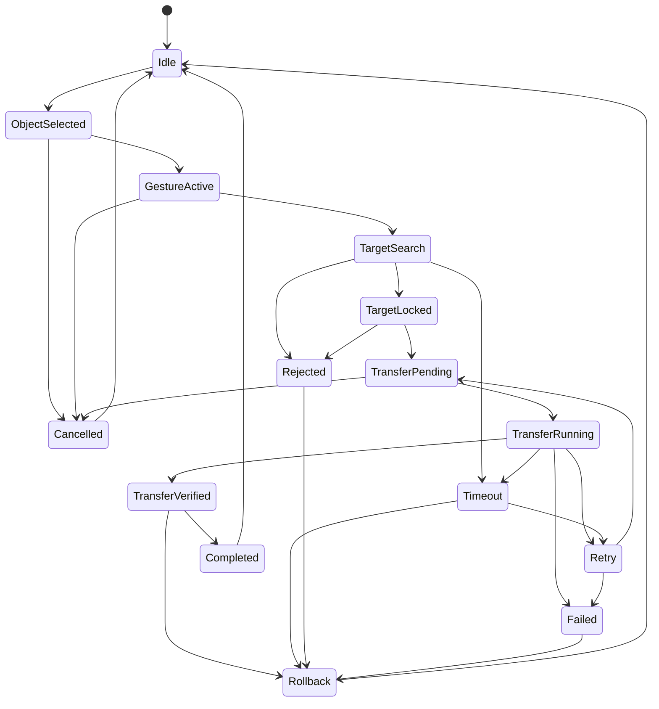

# RKWS-0220 Transfer State Machine Specification

Dokument-ID: RKWS-SPEC-STATE-001  
Version: 1.0.0  
Status: Accepted  
Datum: 2026-07-02

## Zweck

Dieses Dokument definiert die vollstaendige State Machine fuer den Transferprozess. Die State Machine beschreibt Benutzerabsicht, Zielsuche, Transferlauf, Abschluss, Fehler und Wiederherstellung.

## Zustaende

| Zustand | Bedeutung |
| --- | --- |
| `Idle` | Kein aktiver Transfer. |
| `Object Selected` | Ein Objekt ist markiert. |
| `Gesture Active` | Benutzer haelt oder schiebt das Objekt. |
| `Target Search` | System sucht Zielarbeitsflaeche anhand Richtung/Raumkarte. |
| `Target Locked` | Ziel ist eindeutig festgelegt. |
| `Transfer Pending` | Transfer ist vorbereitet und wartet auf Start. |
| `Transfer Running` | Payload wird uebertragen. |
| `Transfer Verified` | Payload und Metadaten sind validiert. |
| `Completed` | Transfer abgeschlossen. |
| `Cancelled` | Benutzer oder System hat kontrolliert abgebrochen. |
| `Failed` | Fehler ohne direkte Fortsetzung. |
| `Timeout` | Zeitlimit erreicht. |
| `Rejected` | Ziel oder Policy lehnt ab. |
| `Retry` | Wiederholversuch wird vorbereitet. |
| `Rollback` | Rueckabwicklung temporarer Daten. |

## Erlaubte Uebergaenge

| Von | Nach | Bedingung |
| --- | --- | --- |
| `Idle` | `Object Selected` | Benutzer markiert ein Objekt. |
| `Object Selected` | `Gesture Active` | Gueltige Geste beginnt. |
| `Object Selected` | `Cancelled` | Auswahl wird aufgehoben. |
| `Gesture Active` | `Target Search` | Richtung oder Randkontakt erkannt. |
| `Gesture Active` | `Cancelled` | Geste wird abgebrochen. |
| `Target Search` | `Target Locked` | Genau ein Ziel gefunden. |
| `Target Search` | `Rejected` | Kein erlaubtes Ziel vorhanden. |
| `Target Search` | `Timeout` | Zielsuche dauert zu lange. |
| `Target Locked` | `Transfer Pending` | Trust, Capabilities und Policy sind gueltig. |
| `Target Locked` | `Rejected` | Ziel lehnt Typ, Groesse oder Policy ab. |
| `Transfer Pending` | `Transfer Running` | Session und Verschluesselung bereit. |
| `Transfer Pending` | `Cancelled` | Benutzer bricht vor Start ab. |
| `Transfer Running` | `Transfer Verified` | Alle Chunks empfangen und Checksum korrekt. |
| `Transfer Running` | `Retry` | Wiederholbarer Transportfehler. |
| `Transfer Running` | `Failed` | Nicht wiederholbarer Fehler. |
| `Transfer Running` | `Timeout` | Laufzeitlimit erreicht. |
| `Transfer Verified` | `Completed` | Ziel bestaetigt Ablage oder Darstellung. |
| `Transfer Verified` | `Rollback` | Validierung nachgelagerter Policy scheitert. |
| `Retry` | `Transfer Pending` | Retry-Budget vorhanden. |
| `Retry` | `Failed` | Retry-Budget erschoepft. |
| `Timeout` | `Retry` | Fehler ist wiederholbar. |
| `Timeout` | `Rollback` | Temporaere Zielartefakte vorhanden. |
| `Rejected` | `Rollback` | Ziel hat bereits temporaere Daten. |
| `Failed` | `Rollback` | Teilzustand muss bereinigt werden. |
| `Rollback` | `Idle` | Bereinigung abgeschlossen. |
| `Completed` | `Idle` | Log abgeschlossen. |
| `Cancelled` | `Idle` | Abbruch abgeschlossen. |

## Zustandsdiagramm

## Invarianten

- `Transfer Running` darf nur nach `Transfer Pending` erreicht werden.
- `Completed` darf nur nach `Transfer Verified` erreicht werden.
- `Rejected`, `Failed` und `Timeout` duerfen keine dauerhaften Teilpayloads ohne `Rollback` hinterlassen.
- `Retry` braucht ein begrenztes Retry-Budget und darf keine Endlosschleife bilden.
- Jeder Endzustand muss ein Logereignis erzeugen.

## Querverweise

- `Spec/ObjectModel.md`
- `Spec/Protocol.md`
- `Spec/TestStrategy.md`
- `Docs/ADR/ADR-0006-gestures-as-primary-interaction.md`

## Aenderungsverlauf

| Version | Datum | Aenderung |
| --- | --- | --- |
| 1.0.0 | 2026-07-02 | Vollstaendige Transfer-State-Machine fuer RKWS-0220 definiert. |
