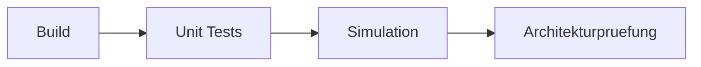

# RKWS Test Specification

Dokument-ID: RKWS-SPEC-TEST-001  
Version: 0.2.0  
Status: Accepted  
Datum: 2026-07-02

## Foundation Tests

Der Foundation-Stand muss Core-Build, Unit-Tests und lokale Simulation erfolgreich ausfuehren.

## Required Unit Coverage

Tests muessen Workspace-Capabilities, Richtungsausloesung, Trust-State-Ablehnung, TransferObject-Erzeugung, DeviceIdentity und lokale Simulation abdecken.

## Simulation Acceptance

Die Simulation muss zwei Arbeitsflaechen erzeugen, Arbeitsflaeche B rechts von A platzieren, ein Textobjekt erzeugen, Richtung `Right` auf B aufloesen, den Transfer planen und ein vollstaendiges Log ausgeben.

## Diagramm

## Querverweise

- `Spec/TestStrategy.md`
- `Docs/07_TestPlan.md`
- `tools/run-tests.ps1`

## Aenderungsverlauf

| Version | Datum | Aenderung |
| --- | --- | --- |
| 0.2.0 | 2026-07-02 | Dokumentstandard und Teststrategie-Verweis ergaenzt. |
| 0.1.0 | 2026-07-02 | Test-Spezifikation angelegt. |
