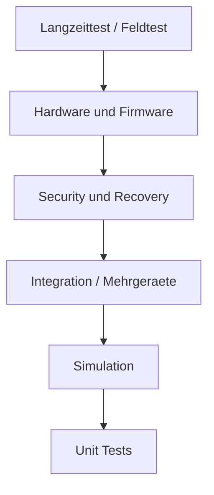

# RKWS-0290 Test Strategy

Dokument-ID: RKWS-SPEC-TEST-STRATEGY-001  
Version: 1.0.0  
Status: Accepted  
Datum: 2026-07-02

## Zweck

Die Teststrategie definiert, wie RK Workspace langfristig pruefbar bleibt. Architektur, Dokumentation, Simulation, Core, Plattformagenten, Firmware und Hardware muessen reproduzierbar getestet werden.

## Testpyramide

## Testbereiche

| Bereich | Ziel | Beispiele |
| --- | --- | --- |
| Unit Tests | Core-Regeln isoliert pruefen. | Objektmodell, WorkspaceMap, TransferPlanner. |
| Integration Tests | Komponenten gemeinsam pruefen. | Agent + Core + Transport-Testdouble. |
| Simulation | Nutzerfluss ohne Plattformrisiko pruefen. | A nach B Texttransfer mit Log. |
| Mehrgeraetebetrieb | Mehrere Arbeitsflaechen und Ziele. | Mehrere rechte Ziele, stale Heartbeats. |
| Offlinebetrieb | Ohne Cloud und eingeschraenktes Netz. | Bereits gepairte lokale Transfers. |
| KVM | Wechselnde Host- und Display-Zuordnung. | KVM Node Trust-Trennung. |
| Industrie | Robuste Diagnose und Policy. | abgeschottete Netze, LAN-only. |
| Headless | Ziel ohne Display. | Ablage und Log ohne Preview. |
| Performance | Latenz, Chunking, Speicher. | Text sofort, Datei spaeter. |
| Security | Pairing, Auth, Revocation. | MITM, Replay, rogue Dongle. |
| Firmware | Boot, Update, Identity. | Recovery, signiertes Update. |
| Hardware | Strom, ESD, Thermik. | Labor- und Produktionstests. |
| Regression | Keine Rueckfaelle. | CI bei Push/PR. |
| Kompatibilitaet | Versionen und Plattformen. | Protocol minor/major. |
| Langzeittest | Stabilitaet ueber Zeit. | Heartbeat, Speicher, Logs. |
| Recovery | Fehler sauber beheben. | Rollback, Schluesselrotation. |

## Foundation-Check

`tools/run-tests.ps1` bleibt der Mindestcheck vor Commit und Push. Er baut den Core, fuehrt Unit-Tests aus und startet die lokale Simulation.

## Querverweise

- `Docs/07_TestPlan.md`
- `Spec/TestSpecification.md`
- `Spec/StateMachine.md`
- `Spec/SecurityModel.md`

## Aenderungsverlauf

| Version | Datum | Aenderung |
| --- | --- | --- |
| 1.0.0 | 2026-07-02 | Vollstaendige Teststrategie fuer RKWS-0290 definiert. |
