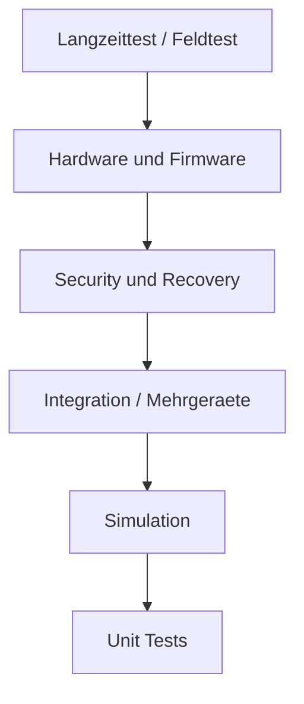

# RKWS-0290 Test Strategy

Dokument-ID: RKWS-SPEC-TEST-STRATEGY-001  
Version: 1.6.0
Status: Accepted  
Datum: 2026-07-02

## Zweck

Die Teststrategie definiert, wie RK Workspace langfristig pruefbar bleibt. Architektur, Dokumentation, Simulation, Core, Plattformagenten, Firmware und Hardware muessen reproduzierbar getestet werden.

## Testpyramide



## Testbereiche

| Bereich | Ziel | Beispiele |
| --- | --- | --- |
| Unit Tests | Core-Regeln isoliert pruefen. | Objektmodell, WorkspaceMap, TransferPlanner. |
| Integration Tests | Komponenten gemeinsam pruefen. | Agent + Core + Transport-Testdouble. |
| Simulation | Nutzerfluss ohne Plattformrisiko pruefen. | A nach B Texttransfer mit Log. |
| Mehrgeraetebetrieb | Mehrere Arbeitsflaechen und Ziele. | Mehrere rechte Ziele, stale Heartbeats. |
| Offlinebetrieb | Ohne Cloud und eingeschraenktes Netz. | Bereits gepairte lokale Transfers. |
| KVM | Wechselnde Host- und Display-Zuordnung. | KVM Node Trust-Trennung. |
| Industrie | Robuste Diagnose und Policy. | abgeschottete Netze, LAN-only. |
| Headless | Ziel ohne Display. | Ablage und Log ohne Preview. |
| Performance | Latenz, Chunking, Speicher. | Text sofort, Datei spaeter. |
| Security | Pairing, Auth, Revocation. | MITM, Replay, rogue Dongle. |
| Firmware | Boot, Update, Identity. | Recovery, signiertes Update. |
| Hardware | Strom, ESD, Thermik. | Labor- und Produktionstests. |
| Regression | Keine Rueckfaelle. | CI bei Push/PR. |
| Kompatibilitaet | Versionen und Plattformen. | Protocol minor/major. |
| Langzeittest | Stabilitaet ueber Zeit. | Heartbeat, Speicher, Logs. |
| Recovery | Fehler sauber beheben. | Rollback, Schluesselrotation. |

## Foundation-Check

`tools/run-tests.ps1` bleibt der Mindestcheck vor Commit und Push. Er baut den Core, fuehrt Unit-Tests aus, fuehrt Integration-Tests aus, startet die lokale Simulation und prueft den Core Demo Runner. Die Ausgabe ist in Build, Unit Tests, Integration Tests, Simulation und Demo Test getrennt.

Ab MA004.01 prueft `tools/run-tests.ps1` zusaetzlich den Agent Smoke-Test mit `tools/run-agent.ps1 -Once`.

## MA003.05 Core Integration Tests

MA003.05 fuehrt das erste separate Integration-Test-Projekt ein: `tests/Integration/RKWorkspace.Core.IntegrationTests/`.

Diese Tests verwenden erstmals alle vier produktiven Core-Komponenten gemeinsam:

- Plugin Manager
- Capability Manager
- Workspace Registry
- Transfer Object Manager

Der erste Szenariosatz prueft einen logischen Texttransfer von Workspace A nach Workspace B, Zielauswahl ueber Position und Capabilities, Fehlerfall ohne passendes Ziel, Auswahl bei genau einem Ziel, verbotene Capabilities und Priority-Tie-Breaks.

Die Integration-Tests verwenden keine Netzwerkkommunikation, keine Betriebssystem-APIs, keine GUI, keine Persistenz, keine Cloud und keine Firmware- oder Hardwarelogik.

## MA003.06 Core Demo Runner Test

MA003.06 fuehrt `src/Demo/RKWorkspace.Core.Demo/` und `tools/run-demo.ps1` ein. Der Demo Runner zeigt den aktuellen Core-Ablauf sichtbar in der Konsole und endet bei Erfolg mit `RESULT: SUCCESS`.

`tools/run-tests.ps1` startet den Demo Runner als Demo Test und prueft:

- Demo-Projekt baut ohne Warnungen und Fehler.
- Demo-Projekt laeuft mit Exitcode 0.
- Ausgabe enthaelt `RESULT: SUCCESS`.

Der Demo Runner ist kein Produktagent, keine GUI, kein Netzwerkdienst, keine Persistenzschicht und kein Plattformadapter.

## MA003.07 Transfer Engine Runtime Tests

MA003.07 erweitert die Unit-Tests um die Transfer Engine Runtime. Geprueft werden TransferRequest, TransferPlan, Planvalidierung, Zielauswahl fuer Right, Left und Any, Required/Forbidden Capabilities, Prepare, Complete, History, fehlende Quelle, fehlendes Ziel, fehlendes Objekt, Cancel, Fail, ExecuteLogicalTransfer und Plattformneutralitaet.

Die Core-Integrationstests verwenden ab MA003.07 die Transfer Engine statt manueller Orchestrierung. Der Szenariosatz bleibt gleich:

- Texttransfer nach rechts.
- Fehlerfall ohne passendes Ziel.
- Auswahl bei genau einem Ziel.
- Ablehnung verbotener Capabilities.
- Priority-Tie-Break bei mehreren passenden Zielen.

Der Demo Runner nutzt ebenfalls `TransferEngine.ExecuteLogicalTransfer`. Damit laufen Unit-Tests, Integration-Tests und sichtbare Demo ueber denselben logischen Core-Pfad.

## MA003.07 Core Runtime Orchestrator Tests

Der Core Runtime Orchestrator wird in Unit-Tests und Integrationstests geprueft. Die Unit-Tests decken RuntimeState, RuntimeConfiguration, Start, Stop, Pause, Resume, Shutdown, Diagnostics, ungueltige Uebergaenge, Initialisierungsfehler und Plattformneutralitaet ab.

Die Integrationstests verwenden die Runtime Engine fuer alle bisherigen Core-Szenarien. Zusaetzlich pruefen sie:

- Runtime initialisiert Plugin Manager, Capability Manager, Workspace Registry und Transfer Object Manager.
- Runtime stoppt aktivierte Plugins sauber.
- Runtime Diagnostics melden RuntimeState, Runtime-Version, Startzeit und Komponentenzaehler korrekt.

Der Demo Runner startet ab diesem Stand zuerst `RuntimeEngine.Start()` und verwendet danach nur die von der Runtime bereitgestellten Manager.

## MA003.08 Developer Workspace Studio Tests

MA003.08 fuehrt `src/Tools/RKWorkspace.DeveloperStudio/` und `tools/run-studio.ps1` ein. Das Studio ist ein Developer-Werkzeug fuer Diagnose, Tests, Demonstration und Core-Visualisierung, keine Endanwender-GUI.

Da stabile UI-Automation zu diesem Zeitpunkt nicht erzwungen wird, gilt fuer MA003.08:

- Das Studio-Projekt muss mit 0 Warnungen und 0 Fehlern bauen.
- `tools/run-studio.ps1 -SmokeTest` muss den vollstaendigen Demo-Pfad ausfuehren und `RESULT: SUCCESS` liefern.
- Bestehende Unit Tests, Integration Tests, Simulation und Demo Runner bleiben gruen.
- Der Core bleibt plattformneutral; die Windows-Desktop-Abhaengigkeit liegt ausschliesslich im separaten Developer-Tool.

## MA004.01 Workspace Agent Runtime Tests

MA004.01 fuehrt `src/Agents/RKWorkspace.Agent/` und `tools/run-agent.ps1` ein. Der Agent ist ein LocalOnly-Konsolenprozess und kein Betriebssystemdienst.

Der Agent Smoke-Test in `tools/run-tests.ps1` fuehrt aus:

```powershell
.\tools\run-agent.ps1 -Once
```

Der Smoke-Test erwartet:

- Exitcode 0.
- Ausgabe enthaelt `RK Workspace Agent`.
- Ausgabe enthaelt `State: Running`.
- Ausgabe enthaelt `stopped cleanly`.

Zusaetzlich bleiben `tools/run-demo.ps1` und `tools/run-studio.ps1 -SmokeTest` als separate Abschlusspruefungen erhalten.

## Querverweise

- `Docs/07_TestPlan.md`
- `Spec/TestSpecification.md`
- `Spec/StateMachine.md`
- `Spec/SecurityModel.md`

## Aenderungsverlauf

| Version | Datum | Aenderung |
| --- | --- | --- |
| 1.6.0 | 2026-07-02 | MA004.01 Workspace Agent Runtime Smoke-Test dokumentiert. |
| 1.5.0 | 2026-07-02 | MA003.08 Developer Workspace Studio Tests dokumentiert. |
| 1.4.0 | 2026-07-02 | Core Runtime Orchestrator Tests dokumentiert. |
| 1.3.0 | 2026-07-02 | MA003.07 Transfer Engine Runtime Tests dokumentiert. |
| 1.2.0 | 2026-07-02 | MA003.06 Core Demo Runner Test dokumentiert. |
| 1.1.0 | 2026-07-02 | MA003.05 Core Integration Tests und getrennte Testausgabe dokumentiert. |
| 1.0.0 | 2026-07-02 | Vollstaendige Teststrategie fuer RKWS-0290 definiert. |
