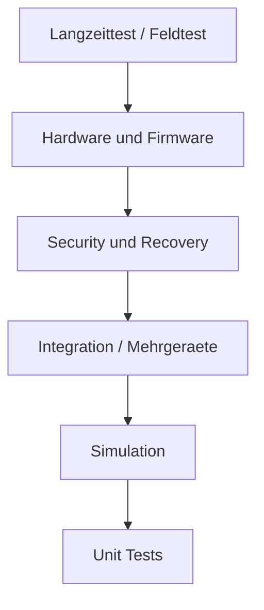

# RKWS-0290 Test Strategy

Dokument-ID: RKWS-SPEC-TEST-STRATEGY-001  
Version: 2.33.0
Status: Accepted  
Datum: 2026-07-04

## Zweck

Die Teststrategie definiert, wie RK Workspace langfristig pruefbar bleibt. Architektur, Dokumentation, Simulation, Core, Plattformagenten, Firmware und Hardware muessen reproduzierbar getestet werden.

## Testpyramide



## Testbereiche

| Bereich | Ziel | Beispiele |
| --- | --- | --- |
| Unit Tests | Core-Regeln isoliert pruefen. | Objektmodell, WorkspaceMap, TransferPlanner. |
| Integration Tests | Komponenten gemeinsam pruefen. | Agent + Core + Transport-Testdouble. |
| Simulation | Nutzerfluss ohne Plattformrisiko pruefen. | A nach B Texttransfer mit Log. |
| Mehrgeraetebetrieb | Mehrere Arbeitsflaechen und Ziele. | Mehrere rechte Ziele, stale Heartbeats. |
| Offlinebetrieb | Ohne Cloud und eingeschraenktes Netz. | Bereits gepairte lokale Transfers. |
| KVM | Wechselnde Host- und Display-Zuordnung. | KVM Node Trust-Trennung. |
| Industrie | Robuste Diagnose und Policy. | abgeschottete Netze, LAN-only. |
| Headless | Ziel ohne Display. | Ablage und Log ohne Preview. |
| Performance | Latenz, Chunking, Speicher. | Text sofort, Datei spaeter. |
| Security | Pairing, Auth, Revocation. | MITM, Replay, rogue Dongle. |
| Firmware | Boot, Update, Identity. | Recovery, signiertes Update. |
| Hardware | Strom, ESD, Thermik. | Labor- und Produktionstests. |
| Regression | Keine Rueckfaelle. | CI bei Push/PR. |
| Kompatibilitaet | Versionen und Plattformen. | Protocol minor/major. |
| Langzeittest | Stabilitaet ueber Zeit. | Heartbeat, Speicher, Logs. |
| Recovery | Fehler sauber beheben. | Rollback, Schluesselrotation. |

## Foundation-Check

`tools/run-tests.ps1` bleibt der Mindestcheck vor Commit und Push. Er baut den Core, fuehrt Unit-Tests aus, fuehrt Integration-Tests aus, startet die lokale Simulation und prueft den Core Demo Runner. Die Ausgabe ist in Build, Unit Tests, Integration Tests, Simulation und Demo Test getrennt.

Ab MA004.01 prueft `tools/run-tests.ps1` zusaetzlich den Agent Smoke-Test mit `tools/run-agent.ps1 -Once`.

Ab MA004.02 prueft `tools/run-tests.ps1` zusaetzlich den Dual-Agent-Harness mit `tools/run-dual-agent.ps1`.

Ab MA004.03 prueft `tools/run-tests.ps1` zusaetzlich den Local-IPC-Zwei-Prozess-Test mit `tools/run-local-ipc.ps1`. Dieser Teil ist durch einen aeusseren 30-Sekunden-Timeout gegen Haenger abgesichert.

Ab MA004.04 pruefen die Unit-Tests zusaetzlich die Transport Abstraction Layer und die NamedPipeTransport-Implementierung. Der Local-IPC-Zwei-Prozess-Test bleibt im Foundation-Check und laeuft intern ueber die TAL.

Ab MA004.X prueft `tools/run-studio.ps1 -SmokeTest` zusaetzlich den Interactive Workspace Prototype. Der Smoke-Test bleibt viewmodelbasiert und erzwingt keine fragile UI-Automation.

Ab MA005.00 prueft `tools/run-studio.ps1 -SmokeTest` zusaetzlich den Multi Window Workspace Prototype. Der Smoke-Test verwendet denselben Core-Kontext wie die sichtbaren Fenster und prueft den Transferpfad von Window A nach Window B ohne echte Maus-UI-Automation.

Ab MA006.01 prueft `tools/run-tests.ps1` zusaetzlich den Workspace Shell Smoke-Test mit `tools/run-shell.ps1 -Once`. Dieser Test startet den vorbereiteten Shell-Produktpfad ohne Hauptfenster, prueft den Runtime-Status und beendet den Prozess wieder sauber.

Ab MA006.02 prueft `tools/run-tests.ps1` zusaetzlich den Workspace Overlay Smoke-Test mit `tools/run-shell.ps1 -OverlaySmokeTest`. Dieser Test initialisiert den Windows-Overlay-Prototyp ohne manuelle Bedienung und prueft Overlay-State, Carry-State-Kompatibilitaet, Demo-Ding, Ablagen und sicheren Exit-Pfad.

Ab MA006.03 prueft `tools/run-tests.ps1` zusaetzlich den Spatial Carry Tray Smoke-Test mit `tools/run-spatial-tray.ps1 -SmokeTest`. Dieser Test startet einen lokalen Web-Prototyp, prueft Tray-, Ablage- und State-Endpunkte, simuliert Pick/Release/Cancel/Place und prueft ab MA006.03-A digitale Hand, freies Ablegen, Ablage-Bubbles und weiche Bewegungsparameter.

Ab MA006.04 prueft derselbe Skriptpfad die Spatial Room Session. Der Smoke-Test startet den lokalen Raum, prueft `/surface/tablet`, `/surface/handy` und `/surface/monitor`, simuliert Pick von Tablet, Preview auf Monitor, Place auf Monitor, Pick von Monitor, Preview auf Tablet, Rueckweg, freies Ablegen und Cancel. Die verfeinerte Fassung prueft zusaetzlich mindestens fuenf vorbereitete Ablagen, Distanz-Lesbarkeit, `OpeningAblage`, aktive Ablage-Linse und sichtbare menschliche Sprache ohne Transport- oder Geraetejargon. Ab MA006.05 prueft der Smoke-Test zusaetzlich taktile UI-Vorbereitung, Vektor-Neigung, reduzierte Wobble-Werte, weiches Snap, digitale Hand, Ghost vor Place, Glide und gespeicherte Zielposition. Ab MA006.06 prueft er Spatial Portal Carry mit Portalphasen, Source-/Target-Progress, Edge-Portal, ReadyToPlace und der Regel, dass das Ding vor `Place` nicht sofort auf die Zielablage springt. Ab MA006.07 prueft er zusaetzlich Surface Overlay Reset: keine zentrale Statuskarte, keine Radarstruktur, keine Empty-Bubbles, Bubbles erst beim Tragen, periphere Bubbles, kein sichtbares `Zuruecklegen` und Standalone-/PWA-Vorbereitung.

Ab MA006.08 prueft `tools/run-tests.ps1` zusaetzlich den Native Spatial Overlay Smoke-Test mit `tools/run-native-overlay.ps1 -SmokeTest`. Dieser Test prueft den nativen Windows-Slice ohne Browser/WebView, randloses transparentes Topmost-Overlay, Demo-Ding, CarryState, digitale Hand, diagonale Vektorantwort, Bubbles nur bei Carry, Bubble-Linsen statt gruenen Punkten, Portal, Mini-Ablage, Glide, Zielposition und sicheren `Esc`-Exit.

Ab MA006.09 prueft `tools/run-tests.ps1` zusaetzlich den Visual Reality Smoke-Test mit `tools/run-visual-reality.ps1 -SmokeTest`. Dieser Test prueft den nativen Visual-Reality-Slice ohne Browser/WebView, sichtbaren Desktop, fuenf Living-Lens-Varianten, Umschalten der Varianten, langsames Erscheinen, subtile Lebendigkeit, digitale Hand, vektorielle Antwort inklusive Diagonalen, geoeffnete Linse, Mini-Ablage, Glide, Ziel-Ghost und sicheren `Esc`-Exit.

Ab MA006.10R prueft `tools/run-tests.ps1` zusaetzlich den Living Lens Smoke-Test mit `tools/run-living-lens.ps1 -SmokeTest`. Dieser Test prueft einen eigenen nativen Windows-Slice ohne Browser/WebView, Real Bubble Lens, Glass Lens, Water Surface Lens, Wormhole Lens, Gravity Lens, Randverankerung, langsames Erscheinen, subtile Lebendigkeit, digitale Griffwirkung ohne stoerenden Rechteckcontainer, vektorielle Antwort inklusive Diagonalen, Lens Absorption, Target Emergence, Timing-Varianten und Visual Target Export.

Ab MA006.11 prueft `tools/run-tests.ps1` zusaetzlich den GPU Living Lens Smoke-Test mit `tools/run-gpu-lens.ps1 -SmokeTest`. Dieser Test prueft den GPU-komponierten Slice ohne Browser/WebView, Desktop-Sampling, Refraction-Vorbereitung, acht Tunnel, Schlund-zentrierten Sog, 10-Sekunden-Handover und ab der Premium-Look-Stufe die drei live umschaltbaren Looks Glasblase, Wurmloch und Hybrid. Ab dem Physical-Glass-Premiumblock prueft er zusaetzlich Glasdicke, chromatische Kanten, Kontakt-Schatten, Caustics und Specular-Sweeps. Ab dem aktiven Shaderblock prueft er, dass ein kompiliertes PixelShader-Material, eine NativeShaderLayer und ShaderMaterialRefraction vorbereitet sind.

Der Premiumblock ergaenzt diesen Test um saubere Desktop-Plates, Selbst-Sampling-Echo-Unterdrueckung und weichere Fresnel-Kante. Damit wird festgehalten, dass Papier, Schatten und Linsenlicht beim aktiven Tragen nicht als langes optisches Echo wieder in die Refraction zurueckgesampelt werden sollen.

Der zweite Premiumblock ergaenzt fließende Pickup-Skalierung, geglaettete Linsenannaeherung, feinere Glasoptik und hochaufloesende Vektoroptik. Damit wird getestet, dass das Ding beim Greifen nicht sprunghaft kleiner wird und die Blase nicht hart anspringt.

Der dritte Premiumblock ergaenzt Live-Desktop-Refraction, Capture-Ausschluss, stabileren Lens-Center-Lock und Mikro-Highlights. Damit wird festgehalten, dass die Blase wieder auf den aktuellen Hintergrund reagieren soll, ohne das eigene Overlay als Echo einzusampeln.

## MA003.05 Core Integration Tests

MA003.05 fuehrt das erste separate Integration-Test-Projekt ein: `tests/Integration/RKWorkspace.Core.IntegrationTests/`.

Diese Tests verwenden erstmals alle vier produktiven Core-Komponenten gemeinsam:

- Plugin Manager
- Capability Manager
- Workspace Registry
- Transfer Object Manager

Der erste Szenariosatz prueft einen logischen Texttransfer von Workspace A nach Workspace B, Zielauswahl ueber Position und Capabilities, Fehlerfall ohne passendes Ziel, Auswahl bei genau einem Ziel, verbotene Capabilities und Priority-Tie-Breaks.

Die Integration-Tests verwenden keine Netzwerkkommunikation, keine Betriebssystem-APIs, keine GUI, keine Persistenz, keine Cloud und keine Firmware- oder Hardwarelogik.

## MA003.06 Core Demo Runner Test

MA003.06 fuehrt `src/Demo/RKWorkspace.Core.Demo/` und `tools/run-demo.ps1` ein. Der Demo Runner zeigt den aktuellen Core-Ablauf sichtbar in der Konsole und endet bei Erfolg mit `RESULT: SUCCESS`.

`tools/run-tests.ps1` startet den Demo Runner als Demo Test und prueft:

- Demo-Projekt baut ohne Warnungen und Fehler.
- Demo-Projekt laeuft mit Exitcode 0.
- Ausgabe enthaelt `RESULT: SUCCESS`.

Der Demo Runner ist kein Produktagent, keine GUI, kein Netzwerkdienst, keine Persistenzschicht und kein Plattformadapter.

## MA003.07 Transfer Engine Runtime Tests

MA003.07 erweitert die Unit-Tests um die Transfer Engine Runtime. Geprueft werden TransferRequest, TransferPlan, Planvalidierung, Zielauswahl fuer Right, Left und Any, Required/Forbidden Capabilities, Prepare, Complete, History, fehlende Quelle, fehlendes Ziel, fehlendes Objekt, Cancel, Fail, ExecuteLogicalTransfer und Plattformneutralitaet.

Die Core-Integrationstests verwenden ab MA003.07 die Transfer Engine statt manueller Orchestrierung. Der Szenariosatz bleibt gleich:

- Texttransfer nach rechts.
- Fehlerfall ohne passendes Ziel.
- Auswahl bei genau einem Ziel.
- Ablehnung verbotener Capabilities.
- Priority-Tie-Break bei mehreren passenden Zielen.

Der Demo Runner nutzt ebenfalls `TransferEngine.ExecuteLogicalTransfer`. Damit laufen Unit-Tests, Integration-Tests und sichtbare Demo ueber denselben logischen Core-Pfad.

## MA003.07 Core Runtime Orchestrator Tests

Der Core Runtime Orchestrator wird in Unit-Tests und Integrationstests geprueft. Die Unit-Tests decken RuntimeState, RuntimeConfiguration, Start, Stop, Pause, Resume, Shutdown, Diagnostics, ungueltige Uebergaenge, Initialisierungsfehler und Plattformneutralitaet ab.

Die Integrationstests verwenden die Runtime Engine fuer alle bisherigen Core-Szenarien. Zusaetzlich pruefen sie:

- Runtime initialisiert Plugin Manager, Capability Manager, Workspace Registry und Transfer Object Manager.
- Runtime stoppt aktivierte Plugins sauber.
- Runtime Diagnostics melden RuntimeState, Runtime-Version, Startzeit und Komponentenzaehler korrekt.

Der Demo Runner startet ab diesem Stand zuerst `RuntimeEngine.Start()` und verwendet danach nur die von der Runtime bereitgestellten Manager.

## MA003.08 Developer Workspace Studio Tests

MA003.08 fuehrt `src/Tools/RKWorkspace.DeveloperStudio/` und `tools/run-studio.ps1` ein. Das Studio ist ein Developer-Werkzeug fuer Diagnose, Tests, Demonstration und Core-Visualisierung, keine Endanwender-GUI.

Da stabile UI-Automation zu diesem Zeitpunkt nicht erzwungen wird, gilt fuer MA003.08:

- Das Studio-Projekt muss mit 0 Warnungen und 0 Fehlern bauen.
- `tools/run-studio.ps1 -SmokeTest` muss den vollstaendigen Demo-Pfad ausfuehren und `RESULT: SUCCESS` liefern.
- Bestehende Unit Tests, Integration Tests, Simulation und Demo Runner bleiben gruen.
- Der Core bleibt plattformneutral; die Windows-Desktop-Abhaengigkeit liegt ausschliesslich im separaten Developer-Tool.

## MA004.01 Workspace Agent Runtime Tests

MA004.01 fuehrt `src/Agents/RKWorkspace.Agent/` und `tools/run-agent.ps1` ein. Der Agent ist ein LocalOnly-Konsolenprozess und kein Betriebssystemdienst.

Der Agent Smoke-Test in `tools/run-tests.ps1` fuehrt aus:

```powershell
.\tools\run-agent.ps1 -Once
```

Der Smoke-Test erwartet:

- Exitcode 0.
- Ausgabe enthaelt `RK Workspace Agent`.
- Ausgabe enthaelt `State: Running`.
- Ausgabe enthaelt `stopped cleanly`.

Zusaetzlich bleiben `tools/run-demo.ps1` und `tools/run-studio.ps1 -SmokeTest` als separate Abschlusspruefungen erhalten.

## MA004.02 Dual Local Agent Simulation Tests

MA004.02 fuehrt `tools/DualAgentHarness/` und `tools/run-dual-agent.ps1` ein. Der Harness startet zwei LocalOnly-Agenten im selben Testprozess, ohne Netzwerk, IPC, Discovery oder Betriebssystemdienst.

Der Dual-Agent-Harness prueft:

- paralleler Start von Agent A und Agent B.
- paralleler Stop von Agent A und Agent B.
- unterschiedliche AgentIds.
- unterschiedliche WorkspaceIds.
- getrennte RuntimeEngine-Instanzen.
- getrennte WorkspaceRegistry-, CapabilityManager- und TransferObjectManager-Instanzen.
- TransferRequest-Erzeugung in Agent A.
- logischer Transfer zu Agent B ueber den Harness.
- TransferResult mit erfolgreichem Source/Target-Abschluss.
- TransferObject existiert nur im TransferObjectManager von Agent A.
- History enthaelt Created, Validated, MetadataUpdated, Prepared und Completed.
- beide Agent-Runtimes bleiben waehrend des Transfers stabil.

`tools/run-tests.ps1` prueft fuer den Harness:

- Exitcode 0.
- Ausgabe enthaelt `RK Workspace Dual Agent Harness`.
- Ausgabe enthaelt `Agent A: rkws-agent-a`.
- Ausgabe enthaelt `Agent B: rkws-agent-b`.
- Ausgabe enthaelt `Transfer Result: SUCCESS`.
- Ausgabe enthaelt `RESULT: SUCCESS`.

## MA004.03 Local IPC Two Process Tests

MA004.03 fuehrt `src/Communication/RKWorkspace.LocalIpc/`, `tools/LocalIpcHarness/` und `tools/run-local-ipc.ps1` ein. Der Test startet zwei echte Agent-Prozesse auf demselben Rechner und verwendet Named Pipes als lokale IPC-Technik.

Der Local-IPC-Harness prueft:

- Agent B startet als eigener Prozess und oeffnet einen lokalen Named-Pipe-Server.
- Agent A startet als eigener Prozess und verbindet sich als Named-Pipe-Client.
- AgentHello funktioniert.
- AgentStatusRequest und AgentStatusResponse funktionieren.
- TransferRequest funktioniert.
- TransferResponse liefert `SUCCESS`.
- Agent A und Agent B stoppen sauber.
- nicht erreichbarer Server wird sauber gemeldet.
- ungueltige Nachricht wird sauber gemeldet.
- unbekannter MessageType wird sauber gemeldet.
- falsche TargetAgentId wird sauber gemeldet.
- TransferRequest ohne Payload wird sauber gemeldet.
- Timeout wird sauber gemeldet.

`tools/run-tests.ps1` prueft fuer den Harness:

- Exitcode 0.
- Ausgabe enthaelt `RK Workspace Local IPC Harness`.
- Ausgabe enthaelt `AgentHello: OK`.
- Ausgabe enthaelt `StatusRequest: OK`.
- Ausgabe enthaelt `TransferRequest: OK`.
- Ausgabe enthaelt `TransferResponse: SUCCESS`.
- Ausgabe enthaelt `RESULT: SUCCESS`.
- externer Timeout maximal 30 Sekunden.

## MA004.04 Transport Abstraction Layer Tests

MA004.04 fuehrt `src/Communication/RKWorkspace.Transport/` und `src/Communication/RKWorkspace.Transport.NamedPipes/` ein. Die Tests pruefen die neutrale Transportschicht ohne TCP, UDP, Discovery, Pairing, Hardware, Firmware oder Cloud.

Die Unit-Tests pruefen:

- `TransportMessage`-Erstellung mit den Live-Workspace-Nachrichtentypen.
- `CorrelationId` fuer Request/Response-Beziehungen.
- `TransportEndpoint`-Validierung fuer Named-Pipe-Endpunkte.
- NamedPipeTransport Client/Server Roundtrip.
- Request/Response ueber `ITransportClient.RequestAsync`.
- Timeout-Verhalten.
- Fehlerantwort bei falscher `TargetId`.

Der Local-IPC-Harness prueft weiterhin den vollstaendigen Zwei-Prozess-Pfad:

- Agent und Harness sprechen ueber `ITransport`, `ITransportClient`, `ITransportServer` und `TransportMessage`.
- `NamedPipeTransport` ist nur die lokale Implementierung.
- Die alte LocalIpc-Schicht bleibt als Kompatibilitaetsschicht erhalten und mappt intern auf `TransportResult`.
- Bestehende CLI-Optionen `--ipc-server`, `--ipc-client`, `--target-agent-id` und `--ipc-stop-after-transfer` bleiben kompatibel.

## MA004.X Interactive Workspace Prototype Tests

MA004.X erweitert das Developer Workspace Studio um den ersten interaktiven Bedienprototyp. Der manuelle Test erfolgt im sichtbaren Studio-Fenster: Textobjekt greifen, nach rechts ziehen, auf Workspace B loslassen und den abgeschlossenen Core-Transfer pruefen.

Der automatisierte Smoke-Test bleibt bewusst viewmodelbasiert:

```powershell
.\tools\run-studio.ps1 -SmokeTest
```

Er prueft:

- Interactive Demo kann initialisiert werden.
- Run Full Interactive Demo loest denselben A-nach-B-Ablauf aus.
- Das Objekt liegt danach in Workspace B.
- Das Objekt erreicht `Completed`.
- History enthaelt `State:Completed`.
- Diagnostics melden `LastResult: SUCCESS`.
- Ausgabe enthaelt `InteractiveDemo: SUCCESS`.
- Ausgabe enthaelt `RESULT: SUCCESS`.

Nicht automatisiert wird echtes Maus-UI-Dragging, weil stabile UI-Automation fuer diesen Entwicklungsprototyp nicht erzwungen wird.

## MA005.00 Multi Window Workspace Prototype Tests

MA005.00 erweitert das Developer Workspace Studio um zwei echte Workspace-Fenster. Der manuelle Test erfolgt im sichtbaren Studio-Fenster ueber `Open Multi Window Prototype`: Objektkarte in Window A greifen, aus dem Fenster heraus ueber Window B ziehen, Ziel-Hervorhebung pruefen, loslassen und den abgeschlossenen Core-Transfer in Window B, History, Diagnostics und Log pruefen.

Der automatisierte Smoke-Test bleibt bewusst viewmodelbasiert:

```powershell
.\tools\run-studio.ps1 -SmokeTest
```

Er prueft:

- Multi-Window-Kontext kann initialisiert werden.
- Window A enthaelt mehrere Demo-Transferobjekte.
- Drag, Target Highlight und Drop werden ueber denselben Core-Kontext simuliert.
- Drop loest `TransferEngine.ExecuteLogicalTransfer()` aus.
- Danach liegt mindestens ein Objekt in Window B.
- Diagnostics melden `LastResult: SUCCESS`.
- Ausgabe enthaelt `MultiWindow: SUCCESS`.
- Ausgabe enthaelt `RESULT: SUCCESS`.

Nicht automatisiert wird echtes Cross-Window-Maus-Dragging, weil stabile UI-Automation fuer diesen Entwicklungsprototyp nicht erzwungen wird.

## MA006.01 Workspace Shell Runtime Host Tests

MA006.01 fuehrt `src/Shell/RKWorkspace.Shell.Host/` und `tools/run-shell.ps1` ein. Der Host ist kein Developer Studio, kein Agent und keine Endanwender-App. Er ist der vorbereitete Produktpfad der unsichtbaren Workspace Shell.

Der Shell Smoke-Test in `tools/run-tests.ps1` fuehrt aus:

```powershell
.\tools\run-shell.ps1 -Once
```

Der Smoke-Test erwartet:

- Exitcode 0.
- Ausgabe enthaelt `RK Workspace Shell`.
- Ausgabe enthaelt `State: Running`.
- Ausgabe enthaelt `CarryState: Empty`.
- Ausgabe enthaelt `RESULT: SUCCESS`.

Der Test prueft keine OS-Hooks, keine transparente Overlay-Anzeige, keine Adapter, keine Discovery und keine Netzwerkfunktion. Er beweist nur, dass die Shell als Runtime-Prozess startbar ist, eine aktive Workspace Session besitzt, den Carry State sichtbar meldet und das vorbereitete Overlay inaktiv laesst.

## MA006.02 Workspace Overlay Prototype Tests

MA006.02 fuehrt `src/Shell/RKWorkspace.Shell.Overlay.Windows/` ein. Das Projekt ist Windows-spezifisch und bleibt vom neutralen Shell-Core getrennt.

Der Overlay Smoke-Test in `tools/run-tests.ps1` fuehrt aus:

```powershell
.\tools\run-shell.ps1 -OverlaySmokeTest
```

Der Smoke-Test erwartet:

- Exitcode 0.
- Ausgabe enthaelt `RK Workspace Overlay Smoke Test`.
- Ausgabe enthaelt `OverlaySmoke: SUCCESS`.
- Ausgabe enthaelt `RESULT: SUCCESS`.

Der Test prueft:

- Shell Runtime startet.
- Overlay-Prototyp kann initialisiert werden.
- Overlay-State erreicht `Placed`.
- Carry-State ist kompatibel zu `WorkspaceCarryState`.
- `Digitales Ding` ist als Demo-Objekt vorhanden.
- `Ablage links` und `Ablage rechts` sind vorbereitet.
- `Esc` ist als sicherer Exit-Pfad vorgesehen.

Der Test prueft nicht:

- echte UI-Automation mit Maus.
- echte Desktop-Objekte.
- globale OS-Hooks.
- Explorer-, Browser-, Office- oder Mail-Adapter.
- Netzwerk, Discovery oder Pairing.

## MA006.03 / MA006.04 Spatial Room Tests

MA006.03 fuehrt `src/Shell/RKWorkspace.Shell.SpatialTray/` und `tools/run-spatial-tray.ps1` ein. Der Prototyp ist ein lokaler Webserver mit statischer HTML/CSS/JavaScript-Oberflaeche fuer Handy oder Tablet.

MA006.04 erweitert ihn zur Spatial Room Session. Alle Surfaces sehen denselben Raumzustand.

Der Smoke-Test fuehrt aus:

```powershell
.\tools\run-spatial-tray.ps1 -SmokeTest
```

Erwartete Ausgabe:

```text
Spatial Room Smoke Test
Health: OK
Handy surface: OK
Tablet surface: OK
Monitor surface: OK
Tactile UI: OK
Surface reset UI: OK
Tactile config: OK
Wobble reduced: OK
Soft snap: OK
Haptics prepared: OK
Glide prepared: OK
Portal prepared: OK
Room ablagen: OK
Prepared ablagen: OK
Initial thing: OK
Empty hides bubbles: OK
Pick removes source: OK
Digital hand: OK
Peripheral bubbles: OK
Source trace: OK
Monitor preview: OK
Target ghost: OK
Portal transition: OK
Source progress: OK
Target progress: OK
No instant jump: OK
Opening ablage: OK
Portal edge: OK
Ready to place: OK
Active bubble: OK
Place on monitor: OK
Target position: OK
Pick from monitor: OK
Tablet preview: OK
Return portal: OK
Place on tablet: OK
Free place: OK
Cancel return: OK
Human words: OK
Bubble distance: OK
Surface bubbles: OK
RESULT: SUCCESS
```

Der Test prueft:

- lokaler Raum startet mit Timeout-Schutz.
- `/health` ist erreichbar.
- `/surface/tablet` ist erreichbar.
- `/surface/handy` ist erreichbar.
- `/surface/monitor` ist erreichbar.
- mindestens drei Ablagen existieren: Tablet, Handy und Monitor.
- mindestens fuenf Ablagen sind vorbereitet.
- das Ding liegt initial auf Ablage Tablet.
- Empty zeigt keine Bubbles und keine zentrale Raumkarte.
- `/api/pick` setzt `carryState` auf `Picked`.
- Pick entfernt das Ding aus der Ursprungslage.
- die digitale Hand meldet kompakte Darstellung und Teilverdeckung.
- Bubbles erscheinen erst nach aktiver Tragehandlung.
- Bubbles liegen peripher am Rand.
- eine Carry Session ist aktiv.
- Annaherung an Monitor erzeugt Preview auf Monitor.
- Annaherung an Monitor setzt `OpeningAblage`.
- die aktive Ablage oeffnet sich als Ablage-Linse.
- die aktive Ablage zeigt `Hier ablegen`.
- Monitor zeigt `Rechnung.pdf kommt an`.
- Monitor zeigt vor Place einen Ghost.
- der Uebergang ist als Gleiten in die Bubble vorbereitet.
- Portalphasen und `SpatialPortalTransition` sind vorbereitet.
- Source-/Target-Progress steigen beim Annaehern.
- die Zielablage am Rand wird als Portal erkannt.
- vor `Place` bleibt das Ding Preview und springt nicht sofort auf die Zielablage.
- die Zielablage meldet `ReadyToPlace`.
- Place legt das Ding auf Monitor ab.
- Place speichert eine relative Zielposition.
- das Ding liegt danach nicht mehr auf Tablet.
- das Ding kann vom Monitor wieder genommen werden.
- Annaherung an Tablet erzeugt Preview auf Tablet.
- Place legt das Ding zurueck auf Tablet.
- freies Ablegen ohne aktive Ablage bleibt an aktueller Position.
- Cancel bringt das Ding zur Quelle zurueck.
- entfernte Bubbles haben keinen lesbaren Namen.
- nahe Bubbles haben einen lesbaren Namen.
- sichtbare Oberflaechen vermeiden technische Sprache.
- statische UI enthaelt Vektor-Neigung, Teilverdeckung, Ablage-Linse und optionale mobile Haptik.
- statische UI enthaelt Portal-, Entering-, Emerging- und ReadyToPlace-Darstellung.
- statische UI enthaelt keine Radarstruktur, keine sichtbare Statusseite und keinen sichtbaren Zuruecklege-Button.
- Web App Manifest bereitet Standalone-Nutzung vor.
- Motion-Konfiguration enthaelt stark reduzierte Wobble-Werte und weiches Einrasten.
- Bubbles existieren auf der Surface.

Der Test prueft nicht:

- echtes Handy oder Tablet.
- echte Payload.
- Discovery.
- Pairing.
- Kamera, UWB oder Raumvermessung.
- Sicherheitsschicht.
- echte physische Mobile-Haptik.
- finale Distanzschwellen.

## MA006.08 Native Spatial Overlay Tests

MA006.08 fuehrt `src/Shell/RKWorkspace.Shell.NativeOverlay.Windows/` und `tools/run-native-overlay.ps1` ein.

Der Smoke-Test fuehrt aus:

```powershell
.\tools\run-native-overlay.ps1 -SmokeTest
```

Erwartete Ausgabe:

```text
RK Workspace Native Spatial Overlay Smoke Test
NativeOverlay: READY
BrowserSurface: NONE
Borderless: OK
TransparentDesktop: OK
TopMost: OK
DemoThing: OK
PickCarryState: OK
DigitalHand: OK
VectorDiagonal: OK
BubblesOnlyOnCarry: OK
BubbleLens: OK
PortalOpen: OK
MiniAblage: OK
GlideIntoPortal: OK
TargetPosition: OK
EscExit: OK
NativeOverlaySmoke: SUCCESS
RESULT: SUCCESS
```

Der Test prueft:

- natives Windows-Projekt startet.
- kein Browser und kein WebView sind Teil des Erlebnisses.
- Overlay ist randlos, transparent, topmost und nicht in der Taskbar.
- Demo-Ding kann erzeugt werden.
- Pick setzt CarryState.
- Ding wird kompakter und teilverdeckt.
- optische Haptik ist vorbereitet.
- Bewegung reagiert vektorbasiert inklusive Diagonalen.
- Bubbles erscheinen erst bei aktivem Carry.
- Bubble-Darstellung ist als Linse vorbereitet, nicht als gruener Punkt.
- Bubble oeffnet sich als Portal.
- Mini-Ablage wird im Portal sichtbar.
- Ding gleitet in das Portal.
- Zielposition wird gespeichert.
- `Esc` beendet sicher.

Der Test prueft nicht:

- echte globale Hotkeys.
- echte Desktop-Objekterkennung.
- echte Payload.
- Discovery, Pairing oder Sicherheitsschicht.
- finale Produktphysik.

## MA006.09 Visual Reality Tests

MA006.09 fuehrt `src/Shell/RKWorkspace.Shell.VisualReality.Windows/` und `tools/run-visual-reality.ps1` ein.

Der Smoke-Test fuehrt aus:

```powershell
.\tools\run-visual-reality.ps1 -SmokeTest
```

Erwartete Ausgabe:

```text
RK Workspace Visual Reality Smoke Test
NativeOverlay: READY
BrowserSurface: NONE
DesktopVisible: OK
LensVariants: 5
VariantSwitching: OK
SlowEmergence: OK
LensLiving: OK
DigitalHand: OK
VectorResponse: OK
DiagonalVector: OK
LensOpen: OK
MiniAblage: OK
GlideIntoLens: OK
TargetGhost: OK
EscExit: OK
VisualRealitySmoke: SUCCESS
RESULT: SUCCESS
```

Der Test prueft:

- natives Windows-Projekt startet.
- kein Browser und kein WebView sind Teil des Erlebnisses.
- Desktop bleibt als Hintergrund sichtbar vorbereitet.
- fuenf Linsen-Hypothesen existieren.
- Varianten sind umschaltbar.
- Linsen erscheinen weich ueber ca. 1 bis 2 Sekunden.
- Linsen besitzen subtile Lebendigkeit.
- gruene Punkte, Button-Optik und Dropzones sind verworfen.
- Ding wird kompakter und teilverdeckt.
- optische Haptik ist vorbereitet.
- Ding reagiert vektorbasiert.
- diagonale Bewegung beeinflusst beide Achsen.
- Linse wird bei Naehe lesbar.
- Linse oeffnet sich mit Tiefe.
- Mini-Ablage wird sichtbar.
- Ding gleitet in die Linse.
- Ghost kommt auf Zielseite heraus.
- `Esc` beendet sicher.

Der Test prueft nicht:

- echte Shader-Brechung.
- echte Per-Pixel-Desktopkomposition.
- echte Desktop-Objekterkennung.
- echte Payload.
- Discovery, Pairing oder Sicherheitsschicht.
- finale Produktphysik.

## MA006.10R Living Lens Tests

MA006.10R fuehrt `src/Shell/RKWorkspace.Shell.LivingLens.Windows/` und `tools/run-living-lens.ps1` ein.

Der Smoke-Test fuehrt aus:

```powershell
.\tools\run-living-lens.ps1 -SmokeTest
```

Erwartete Ausgabe:

```text
RK Workspace Living Lens Smoke Test
NativeOverlay: READY
BrowserSurface: NONE
WebView: NONE
PerPixelAlpha: OK
ColorKeyTransparency: NONE
NoPurpleBlob: OK
NoGreenPoint: OK
NoUiCircle: OK
LensVariants: 5
DefaultGlassLens: OK
RealBubbleLens: OK
EdgeAnchored: OK
PrimaryEdgeLens: OK
NoWhiteAblageFrame: OK
NoAutoAbsorption: OK
LensRelaxAway: OK
LensAbsorption: OK
AbsorptionScale: OK
AbsorptionDistortion: OK
NotInstantGone: OK
TargetGhost: OK
GhostEmergence: OK
PullOutFromLens: OK
TimingVariants: OK
ExportFrames: OK
LivingLensSmoke: SUCCESS
RESULT: SUCCESS
```

Zusaetzlich erzeugt:

```powershell
.\tools\run-living-lens.ps1 -ExportFrames
```

die Zielbilder in:

```text
Docs/VisualTargets/MA00610R/
```

Der Test prueft nicht:

- finale Shader-Brechung.
- echte Desktop-Hintergrundverzerrung.
- echte Payload.

Der Test prueft ausdruecklich, dass die sichtbare Living-Lens-Schicht nicht mehr ueber Magenta-/Color-Key-Transparenz arbeitet. Damit wird verhindert, dass lila/cyan Artefakte wieder als scheinbarer Linsenraum sichtbar werden.

Nach dem Owner-Video-Feedback prueft der Smoke-Test zusaetzlich:

- primaere Linse sitzt am Bildschirmrand.
- kein weisser Innenrahmen als UI-Ziel.
- Pull-out aus der Linse bleibt moeglich.
- Absorption bleibt an Loslassen gekoppelt.
- Discovery, Pairing oder Sicherheitsschicht.
- finale Produktphysik.

## MA006.11 GPU Living Lens Refraction Tests

MA006.11 fuehrt `src/Shell/RKWorkspace.Shell.LivingLens.Gpu.Windows/` und `tools/run-gpu-lens.ps1` ein.

Der Smoke-Test fuehrt aus:

```powershell
.\tools\run-gpu-lens.ps1 -SmokeTest
```

Erwartete Ausgabe:

```text
RK Workspace GPU Living Lens Smoke Test
NativeOverlay: READY
BrowserSurface: NONE
WebView: NONE
GpuComposition: READY
DesktopSampling: OK
DesktopRefraction: OK
ShaderReadyMap: OK
HlslShaderContract: OK
NoPaperAxisSpin: OK
RectangularThing: OK
RectangularShadow: OK
GentleCarryTilt: OK
SoftShadow: OK
PortalEdgePull: OK
PortalEdgeSqueeze: OK
PortalEdgeApexSqueeze: OK
NoTwistPortalFunnel: OK
TiltDampingNearTunnel: OK
TunnelDepthLayers: OK
PremiumTunnelVisual: OK
PremiumTunnelRefraction: OK
PremiumTunnelAperture: OK
EightTunnelField: OK
CornerAndEdgeTunnels: OK
CenterStartObject: OK
VectorSuctionCenter: OK
ThroatSuctionTarget: OK
NoApexOvershoot: OK
StableTunnelTargetLock: OK
ThroatPointCollapse: OK
ThreePremiumLensLooks: OK
GlassBubbleLook: OK
WormholeLook: OK
HybridLook: OK
LiveLookSwitch: OK
CompactCarryCard: OK
CleanDesktopPlate: OK
SelfSamplingEchoSuppression: OK
SoftFresnelEdge: OK
SmoothPickupScale: OK
SmoothLensApproach: OK
UltraFineGlassOptics: OK
HighResolutionVectorOptics: OK
LiveDesktopRefraction: OK
CaptureExclusion: OK
LensCenterLock: OK
MicroGlassHighlights: OK
PhysicalGlassMaterial: OK
GlassThickness: OK
ChromaticEdge: OK
LensContactShadow: OK
GlassCaustics: OK
SpecularGlassSweeps: OK
CompiledPixelShader: OK
NativeShaderLayer: OK
ShaderMaterialRefraction: OK
PrimaryEdgeLens: OK
EdgeContinuation: OK
LensAppearsOnPick: OK
NoWhiteBlock: OK
DropRequiresRelease: OK
PullOutFromLens: OK
VectorTilt: OK
PerspectiveTrapezoid: OK
ShadowModel: OK
ShadowSuction: OK
ShadowTunnelSuction: OK
CalmRestingObjectInTunnel: OK
CarryShadowOnly: OK
TransitTimeoutMs: 10000
TransitCountdown: OK
RetakeResetsTransitTimer: OK
RemotePlacement: OK
TunnelAutoClose: OK
TunnelClosedAfterTransit: OK
RemoteGestureRequired: OK
TransitState: Closed
GpuLivingLensSmoke: SUCCESS
RESULT: SUCCESS
```

Der Test prueft ausdruecklich:

- Desktop-Sampling unter der Linse ist moeglich.
- der GPU-komponierte Slice startet ohne Browser/WebView.
- der rechte Rand ist Durchgang, nicht Zielscheibe.
- die Linse erscheint direkt beim Greifen.
- das Ding rastet nicht automatisch ein.
- Pull-out bleibt moeglich.
- vektorielle Trapez-Neigung und Schattenmodell sind vorbereitet.
- der Schatten wird bei Absorption zur Linse gezogen.
- der Trageschatten ist an den Carry-Zustand gekoppelt.
- das digitale Ding ist fuer den Physiktest ein klares 2D-Rechteck.
- der Trageschatten ist rechteckig-perspektivisch statt elliptisch.
- die normale Trage-Neigung bleibt sanft.
- der Schatten wird ueber weiche Schichten statt als harte Platte gezeichnet.
- die linse-nahe Kante wird vor der Absorption lokal Richtung Tunnel gezogen.
- die tunnelnahe Kante und ihre Ecken werden mit `PortalEdgeSqueeze` lokal zusammengezogen, statt das Ding als Ganzes rotieren zu lassen.
- `PortalEdgeApexSqueeze` laesst die tunnelnahe Kante symmetrisch zu einer Spitze zusammenlaufen.
- `NoTwistPortalFunnel` verhindert die per-Ecke-Verdrehung des Papiers.
- `TiltDampingNearTunnel` reduziert die normale Neigung direkt an der Oeffnung.
- Tunnel-Tiefenschichten sind vorbereitet.
- Premium-Tunnelgrafik mit neutralen Tiefenringen, innerem Schlund und Spiegelkanten ist vorbereitet.
- PremiumTunnelRefraction mit ruhigen Refraction-Ribbons ist vorbereitet.
- PremiumTunnelAperture mit feiner innerer Glas-/Tiefenschichtung ist vorbereitet.
- Acht-Tunnel-Feld mit vier Ecken und vier Seitenmitten ist vorbereitet.
- das digitale Ding startet fuer diesen Test in der Mitte der Arbeitsflaeche.
- die Sogmitte wird vektorbasiert aus dem jeweils naechsten Tunnel bestimmt.
- der sichtbare schwarze Schlund ist das einzige Sogziel fuer Papier und Schatten.
- die Papier-Spitze wird am Schlund gekappt und darf nicht ueber das Ziel hinauslaufen.
- der aktive Tunnel ist gegen unruhiges Umschalten stabilisiert.
- direkt ueber dem Schlund kollabiert das Ding staerker zu einem Punkt.
- die drei Premium-Looks Glasblase, Wurmloch und Hybrid sind vorbereitet.
- die Umschaltung zwischen den Looks ist im laufenden Overlay vorgesehen.
- das Ding wird beim Greifen kompakter dargestellt.
- aktive Refraction verwendet eine saubere Desktop-Plate gegen Selbst-Sampling-Echos.
- der weisse Blasenrand wird durch eine weichere Fresnel-Kante ersetzt.
- das Ding skaliert beim Greifen fließend ueber `PickProgress`.
- die Linse oeffnet durch geglaettete Annaeherung statt durch einen sichtbaren Sprung.
- die Glasoptik wird feiner und ringaermer gezeichnet.
- aktive Linsen samplen den echten Hintergrund wieder live.
- das Overlay wird fuer Screen-Capture ausgeschlossen, damit keine Selbst-Echos entstehen.
- staerkere Lens-Center-Hysterese reduziert sichtbares Hin- und Herspringen.
- Mikro-Highlights staerken Glaswirkung ohne technische Ringoptik.
- Physical Glass Material macht die Linse als transparenten Glas-/Tunnelkoerper lesbar.
- Glasdicke, chromatische Kanten, Kontakt-Schatten, Caustics und Specular-Sweeps sind vorbereitet.
- eine aktive HLSL/WPF-PixelShader-Layer ist vorbereitet.
- der kompilierten Materialshader `LivingLensMaterial.ps` ist Teil des GPU-Lens-Projekts.
- ShaderMaterialRefraction nimmt Lens-Zentrum, Radius, Oeffnung, Look und Zeit als Laufzeitparameter auf.
- der Schatten wird als `ShadowTunnelSuction` mit zur Oeffnung gezogen.
- im Tunnel liegt ein kleines ruhiges Objekt statt eines verdrehten Restobjekts.
- Drop im Tunnel startet einen 10-Sekunden-Handover-Countdown.
- erneutes Nehmen innerhalb dieses Fensters setzt den Countdown zurueck.
- nach unberuehrtem Ablauf schliesst der Tunnel und der lokale Zustand gilt als auf Gegenseite abgelegt.
- ein HLSL-Shader-Vertrag fuer den Direct2D-/Win2D-Pfad liegt im Projekt.

Der Test prueft noch nicht:

- finalen HLSL-Shader.
- finale physikalische Brechung.
- echte Desktop-Objekterkennung.
- echte Payload.
- echte Zielablage auf Tablet oder iPhone.

## Querverweise

- `Docs/07_TestPlan.md`
- `Spec/TestSpecification.md`
- `Spec/StateMachine.md`
- `Spec/SecurityModel.md`

## Aenderungsverlauf

| Version | Datum | Aenderung |
| --- | --- | --- |
| 2.33.0 | 2026-07-04 | GPU Living Lens Smoke-Test um CompiledPixelShader, NativeShaderLayer und ShaderMaterialRefraction erweitert. |
| 2.32.0 | 2026-07-04 | GPU Living Lens Smoke-Test um PhysicalGlassMaterial, GlassThickness, ChromaticEdge, LensContactShadow, GlassCaustics und SpecularGlassSweeps erweitert. |
| 2.31.0 | 2026-07-04 | GPU Living Lens Smoke-Test um LiveDesktopRefraction, CaptureExclusion, LensCenterLock und MicroGlassHighlights erweitert. |
| 2.30.0 | 2026-07-04 | GPU Living Lens Smoke-Test um SmoothPickupScale, SmoothLensApproach, UltraFineGlassOptics und HighResolutionVectorOptics erweitert. |
| 2.29.0 | 2026-07-04 | GPU Living Lens Smoke-Test um CleanDesktopPlate, SelfSamplingEchoSuppression und SoftFresnelEdge erweitert. |
| 2.28.0 | 2026-07-04 | GPU Living Lens Smoke-Test um drei Premium-Looks, LiveLookSwitch und CompactCarryCard erweitert. |
| 2.27.0 | 2026-07-04 | GPU Living Lens Smoke-Test um ThroatPointCollapse erweitert. |
| 2.26.0 | 2026-07-04 | GPU Living Lens Smoke-Test um ThroatSuctionTarget, NoApexOvershoot und StableTunnelTargetLock erweitert. |
| 2.25.0 | 2026-07-04 | GPU Living Lens Smoke-Test um Acht-Tunnel-Feld, Seiten-/Ecktunnel, Center-Start und VectorSuctionCenter erweitert. |
| 2.24.0 | 2026-07-04 | GPU Living Lens Smoke-Test um Apex-Squeeze, NoTwistPortalFunnel, TiltDampingNearTunnel, CalmRestingObjectInTunnel und PremiumTunnelAperture erweitert. |
| 2.23.0 | 2026-07-04 | GPU Living Lens Smoke-Test um NoPaperAxisSpin, PortalEdgeSqueeze, ShadowTunnelSuction und PremiumTunnelRefraction erweitert. |
| 2.22.0 | 2026-07-04 | GPU Living Lens Smoke-Test um PremiumTunnelVisual erweitert. |
| 2.21.0 | 2026-07-04 | GPU Living Lens Smoke-Test um Portal-Handover, 10-Sekunden-Ruecknahmefenster, Timer-Reset und Tunnel-Schliessen erweitert. |
| 2.20.0 | 2026-07-04 | GPU Living Lens Smoke-Test um GentleCarryTilt, SoftShadow und PortalEdgePull erweitert. |
| 2.19.0 | 2026-07-04 | GPU Living Lens Smoke-Test um RectangularThing und RectangularShadow fuer den Physiktest erweitert. |
| 2.18.0 | 2026-07-04 | GPU Living Lens Smoke-Test um HlslShaderContract und ShadowSuction erweitert. |
| 2.17.0 | 2026-07-04 | GPU Living Lens Smoke-Test um LensAppearsOnPick, TunnelDepthLayers, PerspectiveTrapezoid und CarryShadowOnly erweitert. |
| 2.16.0 | 2026-07-04 | MA006.11 GPU Living Lens Smoke-Test mit Desktop-Sampling, Refraction-Vorbereitung und EdgeContinuation dokumentiert. |
| 2.15.0 | 2026-07-04 | Living Lens Smoke-Test um PrimaryEdgeLens, NoWhiteAblageFrame und PullOutFromLens erweitert. |
| 2.14.0 | 2026-07-04 | Living Lens Smoke-Test um Per-Pixel-Alpha, Color-Key-Ausschluss, NoAutoAbsorption und LensRelaxAway erweitert. |
| 2.13.0 | 2026-07-04 | MA006.10R Living Lens Smoke-Test mit Real Bubble Lens, Lens Absorption, Target Emergence, Timing-Varianten und Visual Target Export dokumentiert. |
| 2.12.0 | 2026-07-04 | MA006.09 Visual Reality Smoke-Test mit fuenf Living-Lens-Varianten, langsamem Erscheinen, digitaler Hand, Mini-Ablage, Glide und Ziel-Ghost dokumentiert. |
| 2.11.1 | 2026-07-04 | Spatial Room Smoke-Test auf Tablet als Default-Ablage umgestellt; Handy bleibt als weitere erreichbare Ablage dokumentiert. |
| 2.11.0 | 2026-07-03 | MA006.08 Native Spatial Overlay Smoke-Test mit nativem transparentem Overlay, No-Browser-Regel, digitaler Hand, Bubble-Linsen, Mini-Ablage, Glide und Zielposition dokumentiert. |
| 2.10.0 | 2026-07-03 | MA006.07 Smoke-Test um Surface Overlay Reset, Empty-ohne-Bubbles, periphere Bubbles, keine Radar-/Statusstruktur, kein sichtbares Zuruecklegen und PWA-Vorbereitung erweitert. |
| 2.9.0 | 2026-07-03 | MA006.06 Smoke-Test um Spatial Portal Carry, PortalTransition, Source-/Target-Progress, Edge-Portal, ReadyToPlace und No-Jump-Regel erweitert. |
| 2.8.0 | 2026-07-03 | MA006.05 Smoke-Test um taktile UI, Vektor-Neigung, digitale Hand, Ghost, Glide und Zielposition erweitert. |
| 2.7.0 | 2026-07-03 | MA006.04 Smoke-Test um fuenf Ablagen, OpeningAblage, Ablage-Linse und Distanz-Lesbarkeit erweitert. |
| 2.6.0 | 2026-07-03 | MA006.04 Spatial Room Session Smoke-Test dokumentiert. |
| 2.5.0 | 2026-07-03 | MA006.03-A Smoke-Test fuer digitale Hand, freie Ablage, Ablage-Bubbles und weiche Motion-Parameter dokumentiert. |
| 2.4.0 | 2026-07-03 | MA006.03 Spatial Carry Tray Smoke-Test dokumentiert. |
| 2.3.0 | 2026-07-03 | MA006.02 Workspace Overlay Prototype Smoke-Test dokumentiert. |
| 2.2.0 | 2026-07-03 | MA006.01 Workspace Shell Runtime Host Smoke-Test dokumentiert. |
| 2.1.0 | 2026-07-02 | MA005.00 Multi Window Workspace Prototype Smoke-Test dokumentiert. |
| 2.0.0 | 2026-07-02 | MA004.X Interactive Workspace Prototype Smoke-Test dokumentiert. |
| 1.9.0 | 2026-07-02 | MA004.04 Transport Abstraction Layer Tests dokumentiert. |
| 1.8.0 | 2026-07-02 | MA004.03 Local IPC Two Process Tests dokumentiert. |
| 1.7.0 | 2026-07-02 | MA004.02 Dual Local Agent Simulation Tests dokumentiert. |
| 1.6.0 | 2026-07-02 | MA004.01 Workspace Agent Runtime Smoke-Test dokumentiert. |
| 1.5.0 | 2026-07-02 | MA003.08 Developer Workspace Studio Tests dokumentiert. |
| 1.4.0 | 2026-07-02 | Core Runtime Orchestrator Tests dokumentiert. |
| 1.3.0 | 2026-07-02 | MA003.07 Transfer Engine Runtime Tests dokumentiert. |
| 1.2.0 | 2026-07-02 | MA003.06 Core Demo Runner Test dokumentiert. |
| 1.1.0 | 2026-07-02 | MA003.05 Core Integration Tests und getrennte Testausgabe dokumentiert. |
| 1.0.0 | 2026-07-02 | Vollstaendige Teststrategie fuer RKWS-0290 definiert. |
