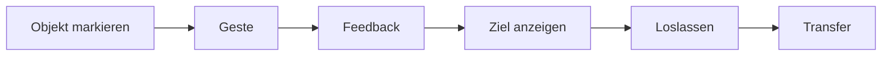

# RKWS UX Specification

Dokument-ID: RKWS-SPEC-UX-001  
Version: 0.7.0
Status: Accepted  
Datum: 2026-07-02

## Principle

Die normale Benutzerinteraktion soll gestenbasiert und unaufdringlich sein. Die GUI ist fuer Einrichtung, Pairing, Diagnose, Logs, Firmware, Hardware und Tests vorgesehen.

## Human Experience Specifications

Human Experience Specifications definieren bewusste Wahrnehmungen vor einer konkreten Interaktion. Sie stehen vor Emotion Specifications, weil der Benutzer zuerst einen Arbeitsraum erleben muss und ein Objekt erst als Teil der eigenen Arbeit wahrgenommen werden muss, bevor es natuerlich gegriffen werden kann.

HX-000 definiert die oberste Wahrnehmung:

```text
Ich betrete meinen Arbeitsraum.
```

HX-001 definiert die erste bewusste Wahrnehmung:

```text
Das gehoert gerade zu meiner Arbeit.
```

HX-001A definiert die digitale Antwort des Objekts:

```text
Das Objekt antwortet mir.
```

Wenn ein Objekt nur am Cursor klebt oder nur animiert wird, entsteht keine glaubwuerdige Kontrolle.

## Emotion Specifications

Emotion Specifications definieren die Zielgefuehle von RK Workspace. Sie sind fuehrende UX-Dokumente und duerfen nicht direkt als finale Loesung interpretiert werden.

ES-001 definiert das erste zentrale Gefuehl:

```text
Ich habe etwas in meiner Hand.
```

ES-002 definiert das zweite zentrale Gefuehl:

```text
Ich trage etwas.
```

Aus Human Experience Specifications und Emotion Specifications folgen Experimente, keine direkten Produktentscheidungen. Codex erzeugt Varianten; der Owner bewertet Wahrnehmung und Gefuehl.

## Directional Intent

Eine Geste wird im Core als Richtung modelliert. V1 nutzt explizite Richtungen wie `Right`, um die Logik testbar zu machen.

## Feedback

Spaetere Agenten muessen Aktivierung, Zielrand, moegliche Ziele, Ablehnung und erfolgreichen Abschluss sichtbar oder haptisch rueckmelden.

## Diagramm



## Querverweise

- `Spec/HumanExperienceSpecification_HX000.md`
- `Spec/HumanExperienceSpecification_HX001.md`
- `Spec/HumanExperienceSpecification_HX001A.md`
- `Spec/EmotionSpecification_ES001.md`
- `Spec/EmotionSpecification_ES002.md`
- `Spec/GestureModel.md`
- `Spec/StateMachine.md`
- `Docs/05_UX_Gestures.md`

## Aenderungsverlauf

| Version | Datum | Aenderung |
| --- | --- | --- |
| 0.7.0 | 2026-07-03 | Human Experience Specification HX-001A als digitale Antwort vor Besitzgefuehl referenziert. |
| 0.6.0 | 2026-07-03 | Human Experience Specification HX-000 als Wahrnehmung vor allen Interaktionen referenziert. |
| 0.5.0 | 2026-07-03 | Human Experience Specification HX-001 als Wahrnehmung vor dem Greifen referenziert. |
| 0.4.0 | 2026-07-03 | Emotion Specification ES-002 als zweites fuehrendes UX-Dokument referenziert. |
| 0.3.0 | 2026-07-03 | Emotion Specification ES-001 als fuehrendes UX-Dokument referenziert. |
| 0.2.0 | 2026-07-02 | Dokumentstandard und Gestenverweise ergaenzt. |
| 0.1.0 | 2026-07-02 | UX-Spezifikation angelegt. |
