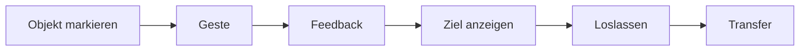

# RKWS UX Specification

Dokument-ID: RKWS-SPEC-UX-001  
Version: 0.2.0  
Status: Accepted  
Datum: 2026-07-02

## Principle

Die normale Benutzerinteraktion soll gestenbasiert und unaufdringlich sein. Die GUI ist fuer Einrichtung, Pairing, Diagnose, Logs, Firmware, Hardware und Tests vorgesehen.

## Directional Intent

Eine Geste wird im Core als Richtung modelliert. V1 nutzt explizite Richtungen wie `Right`, um die Logik testbar zu machen.

## Feedback

Spaetere Agenten muessen Aktivierung, Zielrand, moegliche Ziele, Ablehnung und erfolgreichen Abschluss sichtbar oder haptisch rueckmelden.

## Diagramm

## Querverweise

- `Spec/GestureModel.md`
- `Spec/StateMachine.md`
- `Docs/05_UX_Gestures.md`

## Aenderungsverlauf

| Version | Datum | Aenderung |
| --- | --- | --- |
| 0.2.0 | 2026-07-02 | Dokumentstandard und Gestenverweise ergaenzt. |
| 0.1.0 | 2026-07-02 | UX-Spezifikation angelegt. |
