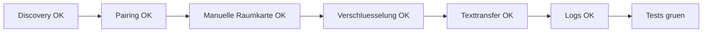

# RKWS-0300 Version V0.1 Definition

Dokument-ID: RKWS-SPEC-VERSION-001  
Version: 1.0.0  
Status: Accepted  
Datum: 2026-07-02

## Zweck

Dieses Dokument definiert die erste reale RK Workspace Version V0.1. V0.1 ist ein enger Windows-zu-Windows-Prototyp, der die Architektur beweist, ohne Plattformbreite oder Hardware zu ueberdehnen.

## Mussumfang

| Bereich | V0.1 Muss |
| --- | --- |
| Plattform | Windows zu Windows. |
| Discovery | Lokale Arbeitsflaechen finden. |
| Pairing | Zwei Windows-Arbeitsflaechen koppeln. |
| Verschluesselung | Session fuer Payloads verschluesseln. |
| Raumkarte | Manuelle Raumkarte mit Richtung. |
| Transfer | Texttransfer. |
| Protokoll | Transfer Request, Accept, Reject, Progress, Finished, Failed. |
| Logging | Lokales strukturiertes Log. |
| Tests | Unit Tests, Simulation, erste Integrationstests. |

## Nichtumfang

Keine globale iOS-Geste, keine macOS/Linux-Agenten als Muss, keine Datei- oder PDF-Transfers als Muss, keine Hardware-Dongles, kein UWB, keine Cloud-Pflicht, keine Bildschirmuebertragung.

## Abnahmekriterien

V0.1 ist abgenommen, wenn zwei Windows-Arbeitsflaechen sich lokal finden, explizit gepairt werden, ein Textobjekt per Richtung auf die andere Arbeitsflaeche geplant und verschluesselt uebertragen wird, Fehler mit definierten Error Codes geloggt werden und CI plus lokale Tests gruen sind.

## Querverweise

- `Spec/Protocol.md`
- `Spec/SecurityModel.md`
- `Spec/StateMachine.md`
- `Spec/TestStrategy.md`

## Aenderungsverlauf

| Version | Datum | Aenderung |
| --- | --- | --- |
| 1.0.0 | 2026-07-02 | V0.1 fuer RKWS-0300 definiert. |
