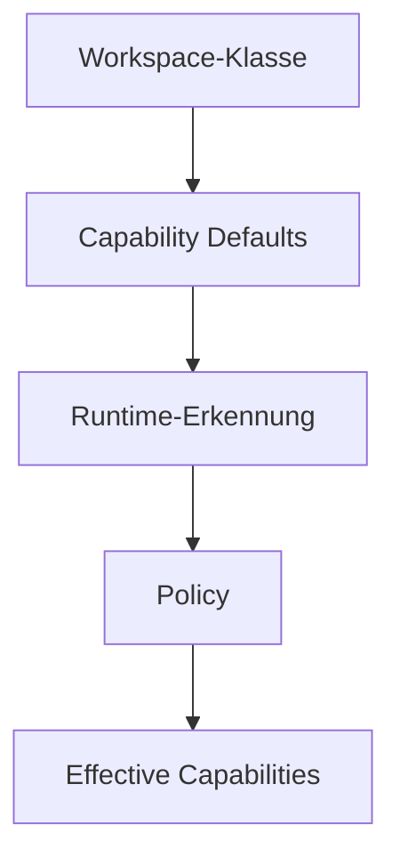

# RKWS-0380 Workspace Capability Matrix

Dokument-ID: RKWS-SPEC-CAPABILITY-MATRIX-001  
Version: 1.0.0  
Status: Accepted  
Datum: 2026-07-02

## Zweck

Diese Matrix beschreibt typische Capabilities je Workspace-Klasse. Sie ist kein Ersatz fuer Runtime-Erkennung. Jede spaetere Implementierung muss tatsaechliche Capabilities erkennen, validieren und durch Policy filtern.

Legende: `Y` vorhanden, `O` optional/abhaengig vom Modell oder Policy, `N` fehlt typischerweise, `R` eingeschraenkt.

## Eingabe und Feedback

| Workspace-Klasse | Touch | Touchpad | Mouse | Keyboard | Display | Multiple Displays | Haptic Feedback | Animation | Overlay | Notification |
| --- | --- | --- | --- | --- | --- | --- | --- | --- | --- | --- |
| Windows Desktop | N | O | Y | Y | Y | O | N | Y | O | Y |
| Windows Laptop | O | Y | O | Y | Y | O | N | Y | O | Y |
| MacBook | N | Y | O | Y | Y | O | O | Y | O | Y |
| Mac mini | N | O | O | O | O | O | N | Y | O | Y |
| Linux Desktop | N | O | Y | Y | Y | O | N | Y | O | O |
| Linux Laptop | O | O | O | Y | Y | O | N | Y | O | O |
| iPhone | Y | N | O | O | Y | N | Y | Y | R | Y |
| iPad | Y | O | O | O | Y | O | Y | Y | R | Y |
| Android Phone | Y | N | O | O | Y | N | O | Y | R | Y |
| Android Tablet | Y | O | O | O | Y | O | O | Y | R | Y |
| Display Node | N | N | N | N | Y | O | N | O | O | O |
| Headless Node | N | N | O | O | N | N | N | N | N | O |
| KVM Node | N | O | O | O | Y | O | N | O | O | O |
| Cloud Workspace | N | N | N | N | N | N | N | N | N | O |
| Remote Workspace | O | O | O | O | O | O | O | O | O | O |

## Kommunikation und Hardware

| Workspace-Klasse | BLE | WLAN | LAN | USB | USB-C | UWB | Hardware Node | Display Node | Firmware Update |
| --- | --- | --- | --- | --- | --- | --- | --- | --- | --- |
| Windows Desktop | O | O | Y | Y | O | O | N | N | N |
| Windows Laptop | O | Y | O | Y | O | O | N | N | N |
| MacBook | O | Y | O | Y | Y | O | N | N | N |
| Mac mini | O | Y | Y | Y | O | O | N | N | N |
| Linux Desktop | O | O | Y | Y | O | O | N | N | N |
| Linux Laptop | O | Y | O | Y | O | O | N | N | N |
| iPhone | O | Y | N | R | Y | O | N | N | N |
| iPad | O | Y | O | R | Y | O | N | N | N |
| Android Phone | O | Y | N | R | O | O | N | N | N |
| Android Tablet | O | Y | O | R | O | O | N | N | N |
| Display Node | O | O | O | O | O | O | Y | Y | Y |
| Headless Node | O | O | Y | O | O | O | O | N | O |
| KVM Node | O | O | O | O | O | O | Y | Y | Y |
| Cloud Workspace | N | N | N | N | N | N | N | N | N |
| Remote Workspace | N | O | O | N | N | N | N | O | N |

## Daten- und Sicherheitsfunktionen

| Workspace-Klasse | Clipboard | Drag & Drop | Context Transfer | Logging | Encryption | Pairing | Offline Mode | Cloud Mode |
| --- | --- | --- | --- | --- | --- | --- | --- | --- |
| Windows Desktop | Y | Y | O | Y | Y | Y | Y | O |
| Windows Laptop | Y | Y | O | Y | Y | Y | Y | O |
| MacBook | Y | Y | O | Y | Y | Y | Y | O |
| Mac mini | Y | Y | O | Y | Y | Y | Y | O |
| Linux Desktop | O | O | O | Y | Y | Y | Y | O |
| Linux Laptop | O | O | O | Y | Y | Y | Y | O |
| iPhone | R | R | O | Y | Y | Y | O | O |
| iPad | R | R | O | Y | Y | Y | O | O |
| Android Phone | R | R | O | Y | Y | Y | O | O |
| Android Tablet | R | R | O | Y | Y | Y | O | O |
| Display Node | N | N | N | Y | Y | Y | O | N |
| Headless Node | O | N | O | Y | Y | Y | Y | O |
| KVM Node | O | O | O | Y | Y | Y | O | N |
| Cloud Workspace | O | N | O | Y | Y | Y | N | Y |
| Remote Workspace | O | O | O | Y | Y | Y | O | O |

## Architekturhinweis

Die Matrix liefert Defaults. Die effektiven Capabilities entstehen erst nach Runtime-Erkennung, Sicherheitspruefung und Policy-Filter.

## Querverweise

- `Spec/CapabilityModel.md`
- `Spec/DisplayNodeModel.md`
- `Spec/WorkspaceModel.md`

## Aenderungsverlauf

| Version | Datum | Aenderung |
| --- | --- | --- |
| 1.0.0 | 2026-07-02 | Workspace-Capability-Matrix fuer RKWS-0380 definiert. |
