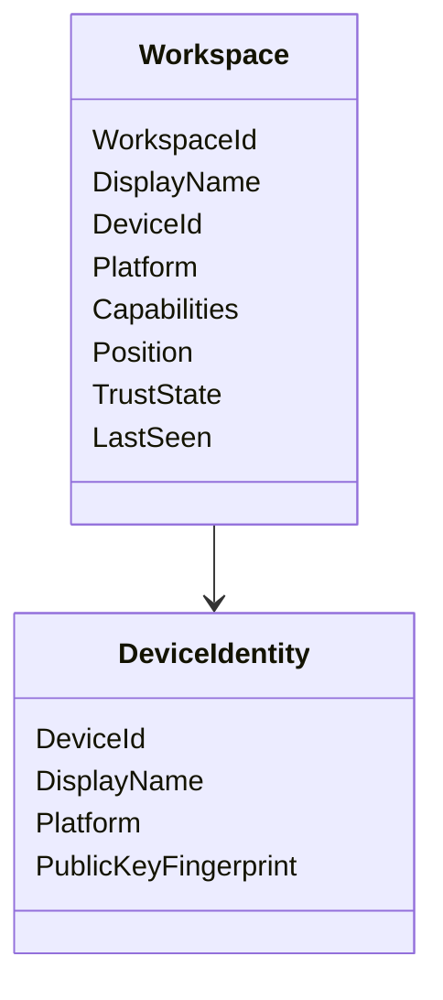

# RKWS Workspace Model Specification

Dokument-ID: RKWS-SPEC-WORKSPACE-001  
Version: 1.1.0
Status: Accepted  
Datum: 2026-07-02

## Zweck

Das Workspace-Modell definiert Arbeitsflaechen als zentrale RK Workspace Abstraktion. Es gilt fuer Smart Devices, Display Nodes, Headless Nodes, KVM Nodes, Remote Workspaces, Cloud Workspaces und Hybrid Workspaces.

## Workspace

Eine `Workspace` ist eine nutzbare digitale Arbeitsflaeche. Sie besitzt `WorkspaceId`, `DisplayName`, `DeviceId`, `Platform`, `Capabilities`, `Position`, `TrustState` und `LastSeen`.

## Positions

V0.1 unterstuetzt `Left`, `Right`, `Above`, `Below`, `Center` und `Unknown`. Die Position ist zuerst manuell. Automatische Positionsbestimmung durch UWB ist eine spaetere Erweiterung und darf manuelle Raumkarten nicht ersetzen, bevor sie validiert ist.

## Trust

Transfers duerfen nur geplant werden, wenn Quelle und Ziel `Paired` oder `Trusted` sind. `Unknown`, `Untrusted`, `PairingPending` und `Revoked` duerfen keinen Payload-Transfer erlauben.

## Capabilities

Capabilities beschreiben, welche Objektarten und Protokollrollen eine Arbeitsflaeche unterstuetzt. Der Core muss Capabilities pruefen, bevor ein Transferobjekt erzeugt wird.

## MA003.03 Workspace Registry

MA003.03 fuehrt die plattformneutrale Workspace Registry als dritte produktive Core-Komponente ein. Die Implementierung liegt in `src/Core/Workspaces/` und verwaltet bekannte Arbeitsflaechen ueber stabile `WorkspaceId`-Werte, `WorkspaceDescriptor`, `IWorkspace` und `IWorkspaceRegistry`.

Die Registry arbeitet ausschliesslich mit Arbeitsflaechen und Capabilities. Geraete bleiben Implementierungsdetails. `WorkspaceDescriptor.Capabilities` verwendet direkt `CapabilitySet`; Suchanfragen nutzen `WorkspaceQuery` mit required und optional Capabilities.

Die Zielauswahl V1 ist bewusst logisch und manuell:

- Position wird als konfigurierter Wert behandelt.
- Capabilities werden ueber das Capability-Modell bewertet.
- Trust, Priority und LastSeen dienen als deterministische Tie-Breaker.
- UWB, Sensorik, automatische Raumvermessung, Netzwerkverbindungen und OS-APIs sind nicht Bestandteil dieses Schritts.

## Querverweise

- `Spec/DisplayNodeModel.md`
- `Spec/SecurityModel.md`
- `Docs/ADR/ADR-0001-workspaces-instead-of-devices.md`

## Aenderungsverlauf

| Version | Datum | Aenderung |
| --- | --- | --- |
| 1.1.0 | 2026-07-02 | MA003.03 Workspace Registry und logische Zielauswahl V1 ergaenzt. |
| 1.0.0 | 2026-07-02 | Workspace-Modell fuer Architektur-Freeze erweitert. |
| 0.1.0 | 2026-07-02 | Erstes Workspace-Modell angelegt. |
